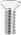

# Getting Started With Micro:bit Mini Smart Robot V2

## Description

Micro:bit is significantly applied to STEM education for teenagers, as a small
microcontroller, which features small in size, easy to carry, and powerful
function. At present, innovative technology products, like robots, wearable
devices and interactive electronic games can be produced by programming and
code.

In this kit, we will guide you how to control and generate a Micro:bit turtle
smart car through programming in Makecode.

[MakeCode](https://makecode.com/) is a framework for creating interactive and
engaging programming experiences for those new to the world of programming. The
platform provides the foundation for a tailored coding experience to create and
run user programs on actual hardware or in a simulated target.

To make you deeply know the micro:bit, we provide test code and projects.

The Keyestudio micro:bit smart car integrates obstacle avoidance, line tracking
and IR and Bluetooth control functions. It contains passive buzzer, ultrasonic
sensor, KEYES-2812-18R module, IR obstacle avoidance sensor and so on.

The passive buzzer makes music play, a KEYES-2812-18R module can display
different effects, a photoresistor can detect light intensity.

Simultaneously, this smart car is chargeable. You only connect power to the port
of battery holder.

**When doing experiment with latest micro:bit, you need to transfer code into
Makecode online editor first, save code again then download it to micro:bit.**

## Specifications

1.  Voltage: DC 5V

2.  Current: USB power supply or power supply with a capacity greater than or
    equal to 2A

3.  Maximum power: maximum output power is 10W

4.  Operating temperature range: 0-50 degrees Celsius

5.  Dimensions: 120*90.7mm

6.  Environmental attributes: ROHS

## Product Kit
|     |      |    |    |
| --  | --   | -- |        --         |                                  
| 1                   |  Micro:bit Mini Smart Robot Car Shield V2  | 1       |                                                                                                                                                                                                                                                                                                                                         |
| 2                    | HC-SR04 Ultrasonic Sensor                                                    | 1       |                                                                                                                                                                                                                                                                                                                                          |
| 3                    | KEYES-2812-18R Module（welded with yellow curved pin）                       | 1       |                                                                                                                                                                                                                                                                                                                                         |
| 4                    | KS0426 doesn’t include  the microbit                                       | 0       |                                                                                                                                                                                                                                                                   |
|                      | KS4019 has the micro：bit                                                    | 1       |                                                                                                                                                                                                                                                                                                                                                                                          |
| **Other Parts**      |                                                                              |         |                                                                                                                                                                                                                                                                                                                                                                                          |
| 4                    | Acrylic Pack of 3 Pieces T=3MM                                               | 1       |                                                                                                                                                                                                                        |
| 5                    | N20 Motor Wheel                                                              | 2       |                                                                                                                                                                                                                                                                                                                                         |
| 6                    | Steel Universal Wheel W22*H15MM                                             | 1       |                                                                                                                                                                                                                                                                                                                                          |
| 7                    | Insulation Gasket                                                            | 3       |                                                                                                                                                                                                                                    |
| 8                    | USB Cable                         | 1       |                                                                                                                                                                                                                                                                                                                                         |
| 9                    | Male to Female Jumper Wire 10CM                                  | 3       |                                                                                                                                                                                                                                                                                                                                    |
| 10                   | Male to Female Jumper Wire 15CM                                  | 4       |                                                                                                                                                                                                                                                                                                                                    |
|  **Screws and Nuts** |                                                                              |         |                                                                                                                                                                                                                                                                                                                                                                                          |
| 11                   | M1.6\*10MM Round Head Screw                                                  | 8       |                                                                                                                                                                                                                                                                                    |
| 12                   | M3\*6MM Round Head Screw                                                     | 8       |                                                                                                                                                                                                                                                                                                                                          |
| 13                   | M1.6 304 Stainless Steel Nut                                                 | 8       |                                                                                                                                                                                          |
| 14                   | M3\*35MM Double Pass Hex Copper Pillar                                       | 4       |                                                                                                                                                                                                                                                                                                                                          |
| 15                   | M3\*10MM Flat Head Screw                                                     | 1       |                                                                                                                                                                                                                                                                                                                                          |
| 16                   | M3 Nickel Plated Nut                                                         | 1       |                                                                                                                                                                                                                                                                                                                                          |
| 17                   | M2.5\*10MM Round Head Screw                                                  | 2       |                                                                                                                                                                                                                                                                                            |
| 18                   | M2\*12MM Round Head Screw                                                    | 8       |  |
| 19                   | M2 Nickel-plated Nut                                                         | 6       |                                                                                                |
| **Tools**            |                                                                              |         |                                                                                                                                                                                                                                                                                                                                                                                          |
| 20                   | 3\*40MM Cross Screw Driver                                                   | 1       |                                                                                                                                                                                                                                                                                                                                          |
| 21                   | Map                                                                          | 1       |                                                                                                                                                                                                                                                                                                                                           |
| 22                   | 2*40MM Screw Driver                                                         | 1       |                                                                                                                                                                                                                                                                                                                                           |

## Micro:bit

Micro:bit, created by the BBC, aims at helping kids over 11 to gain insight to
programming. It is home to abundant resources like a 5*5 LED, two programmable
buttons, compass, Micro USB port and Bluetooth module. It is the half size of
credit card, but mighty. Additionally, it can applied to video games, robots,
science experiments and so on.

The Micro:bit V2 consists of a touch sensitive logo, a MEMS microphone and a
buzzer at the back. The wave-shaped golden edge connectors can be attached to
other sensors or modules by alligator clips. Besides, you can press reset/power
button to activate sleep mode, so that the power consumption can be reduced. Its
CPU performance is better than V.15.

**Pin Diagram**

Micro:bit V1.5

The reset/ power button can reset the running program.

Hold it down, then the indicator will get dark; and release it, the sleep mode
will be activated.

More details:

https://tech.microbit.org/hardware/

https://microbit.org/new-microbit/

https://www.microbit.org/get-started/user-guide/overview/

https://microbit.org/get-started/user-guide/features-in-depth/

Official Website：<https://tech.microbit.org/hardware/edgeconnector/>

<https://microbit.org/guide/hardware/pins/>

**Precaution:**

a. We suggest that you put silicone case on V2 Micro:bit to refrain from short
circuit.

b. The drive capacity of IO ports is weak; therefore, don’t connect component
with large current(like MG995 servo, DC motor) in case V2 board gets
damaged. You have to know about the working current of the component you
use. Generally, we will attach a Micro:bit expansion board.

c. Supply power via USB and 3V battery socket. And it doesn’t support 5V
sensors. If you have to use 5V sensors, you can use Micro:bit expansion board.

d. The shared pins like P3, P4, P6, P7 and P10 of LED dot matrix should be
disabled in the code (use block
); otherwise, there will be
errors on LED dot matrix and data.

e. Don’t attach 3.3V batteries to battery socket; otherwise, V2 will be damaged.

f. Don’t operate it on metal products.

In terms of programming environment, the BBC provides the online programming
website：<https://microbit.org/code/>

### 1.Install the Driver of Micro:bit：

Enter the Micro:bit Driver folder (link: <https://fs.keyestudio.com/KS0426>

) to check how to install the driver of Micro:bit V2

### 2 Keyestudio Micro:bit Mini Smart Car

**Rechargeable Battery**

The keyestudio micro:bit smart car is supplied power by a 18650 battery or USB
port. The battery is rechargeable and maximum current is 700 mA.

Note: the battery is not included in this kit.

**Indicator**

Show the working status of keyestudio micro:bit smart car.

| LED  | Name                                               | LED on              | LED off                 |
|------|----------------------------------------------------|---------------------|-------------------------|
| D2   | Left line tracking sensor                          | Detect white object | Detect black line       |
| D6   | Right line tracking sensor                         | Detect white object | Detect black line       |
| SIG1 | Left obstacle avoidance sensor                     | Detect obstacles    | No obstacle is detected |
| SIG2 | Right obstacle avoidance sensor                    | Detect obstacles    | No obstacle is detected |
| POW  | Power indicator                                    |                     |                         |
| LED1 | LED1 is always on when the power is fully charged. |                     |                         |

**Potentiometer**

| **Potentiometer**                   | Adjust sensitivity                                                                                                                                                      |
|-------------------------------------|-------------------------------------------------------------------------------------------------------------------------------------------------------------------------|
| RP1 Right line tracking sensor      | Put a paper under the bottom of car, adjust the RP1. When D2 is on, then pull up the universal wheels for 0.5cm off the paper. The sensitivity is set well if D2 is off |
| RP2 Left line tracking sensor       | Refer to RP1                                                                                                                                                            |
| RP5 Left obstacle avoidance sensor  | Keep left obstacle avoidance sensor about 5cm away the obstacle. Adjust the RP5 and SIGI is on. The sensitivity is set well if the obstacle is removed and SIGI is off  |
| RP9 Right obstacle avoidance sensor | Keep right obstacle avoidance sensor about 5cm away the obstacle. Adjust the RP9 and SIG2 is on. The sensitivity is set well if the obstacle is removed and SIG2 is off |

### 3 Assembly Guide

Note: Peel the plastic film off the board first when installing the smart car.
To be honest, we never intend to send wood to you.

  Install base plate of micro:bit mini smart car

(Take out the two self-tapping screws of universal wheels first, we provide the
2 pcs longer self-tapping screws to replace them, and don’t screw them too
tightly）

  Mount the top board of micro:bit smart car

（Note：Install it after peeling off the protective film on acrylic board.)

  Wiring

| Sensors/modules            | Pins | Shield |
|----------------------------|------|--------|
|  KEYES-2812-18R module     | G    | G      |
|                            | V    | V      |
|                            | D1   | D5     |
|  HC-SR04 Ultrasonic Sensor | Gnd  | G      |
|                            | Echo | D15    |
|                            | Trig | D14    |
|                            | Vcc  | 5V     |

  Install Micro:bit Board

