# Makecode Tutorial

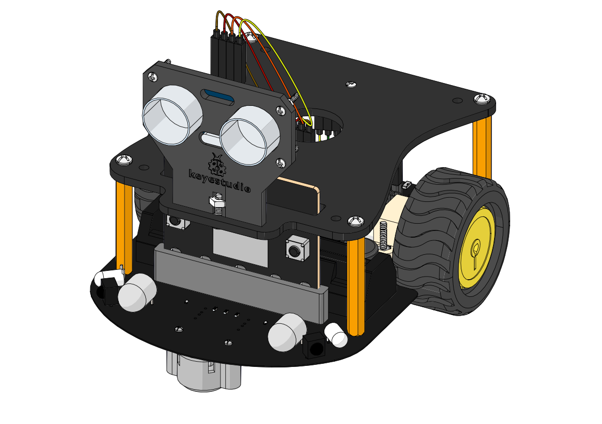

##  Getting Started With Makecode

We take Windows system as example to show you.

Get started with Micro:bit: <Https://microbit.org/guide/quick/>

Step 1: Connect Micro：bit Board

Link micro:bit board to computer with USB cable.（Guide to mobile
apps：<https://microbit.org/get-started/user-guide/mobile/>）

Macs ,PCs, Chromebooks and Linux system（including Raspberry Pi）support
micro：bit.

There will be a MICROBIT drive in your computer, as shown below:

Step 2: Programming

We recommend you to use Google Chrome

Enter <https://makecode.microbit.org/> then click
 and you will view the dialog
box.

Input“heartbeat”to name your project and click“Create”

If you use Windows 10 system, you can also program via Windows 10 App

[https://www.microsoft.com/zh-cn/p/makecode-for-micro-bit/9pjc7sv48lcx?ocid=badgep&rtc=1&activetab=pivot:overviewtab](https://www.microsoft.com/zh-cn/p/makecode-for-micro-bit/9pjc7sv48lcx?ocid=badgep&rtc=1#activetab=pivot:overviewtab)

（we use Google Chrome as a browser）

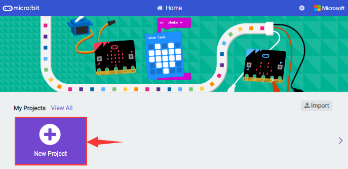

Through MakeCode editor, you just need to drag blocks into code editing area to
design program. There is a video to show you how to finish“heartbeat”pattern.

Look through the demonstration video in the link:
<https://fs.keyestudio.com/KS0426>

Next, we will introduce Makecode.

Click “JS JavaScript”to find corresponding programming language, as shown below;

You can also click “JS JavaScript”to choose “Python”to find corresponding Python
language, as shown below;

Step 3: Download Code

If your computer is Windows 10 and you have downloaded the APP MakeCode for
micro:bit to write program, what you will have to do to download the program to
your Micro: Bit main board V2 is merely clicking the ‘Download’ button, then all
is done.

If you are writing programs through the website, following these steps:

Enter Makecode editor, tap“Download”to get a“hex”file. Then copy it into
MICROBIT drive.

Get“hex”file firstly, drag or copy it in MICROBIT drive.

Then hex file will be copied on MICROBIT drive.

When the hex file is being copied, indicator on micro:bit will flash; after it
is copied, the indicator will keep on.

Step 4: Run program

After the program is uploaded to the Micro: Bit main board V2, you could still
power it via the USB cable or change to via an external power. The 5 x 5 LED dot
matrix on the board displays the heartbeat pattern.

micro USB cable external power（3V）

Step 5：other programming languages

This chapter has described how to use the Micro: Bit main board V2.

But except for the Makecode graphical programming introduced you can also write
Micro: Bit programs in other languages. Go to the link:
<https://microbit.org/code/> to know about other programming languages , or view
the link: <https://microbit.org/projects/>, to find something you want to have a
go.

### 5.1 Makecode

Browse <https://makecode.microbit.org/> and enter Makecode online editor.

Click“New Project”, and input“heartbeat”，then enter Makecode editor, as shown
below:

There are block“on start”and“forever”in the code editing area.

After power on or reset, “on start”means that command blocks in the code are
only executed once, however,“forever”implies that code runs cyclically.

### 5.2 Quick Download

As mentioned before, if your computer is Windows 10 and you have downloaded the
APP MakeCode for micro:bit to write programs, the program written can be quickly
downloaded to the Micro: Bit main board V2 by selecting ‘Download’.

While it is a little more trickier if you are using a browser to enter makecode.
However, if you use Google Chrome, suitable for Linux，macOS and Windows 10, the
process can be quicker too.

We use the webUSB function of Chrome to allow the internet page to access the
hardware device connected USB.

You could refer to the following steps to connect and pair devices.

Connect to computer by USB cable. Click“...”beside“Download”and click“Pair
device”.

Continue to tap“Pair device”

Then select the device you want to connect and“connect”in the window popping up

If there is no device in the window, please refer the following link:

[https://makecode.microbit.org/device/usb/webusb/troubleshoot](https://makecode.microbit.org/device/usb/webusb/troubleshoot%20)

We also provide in the resource
link.

What’s more, if you don’t know how to update the firmware of micro:bit, refer
the link:
[https://microbit.org/guide/firmware/](https://microbit.org/guide/firmware/%20)
or browse we provide.

After connecting successfully, press buttons and download program to micro:bit
board.

### 5.3 How to Import Makecode Extension Library

Next, we need to import K-bit extension library for using in further lessons.

**For simple projects, you can drag blocks to edit the program.**

**For complex ones, you just drag the code we provide to online Makecode**

Add a Kit-bit extension library

Enter Makecode and click icon and
tap 

Copy <https://github.com/mworkfun/pxt-k-bit.git> in the searching box and search
k-bit library.

You can also select below extension library to import them directly.

“K-bit”extension library will appear in the page, click it to install and you
need to wait for a while.

After installation, you can view K-bit extension library in the Makecode Blocks.

**Note: the added extension library is only valid to one project, therefore, it
won’t appear in other projects.**

**You need to add the K-bit extension library again when creating new
projects.**

Update or Delete K-bit Extension Library

Refer to the following instruction please, if you intend to update or delete
K-bit extension library.

Click "Js JavaScript" button to switch into text code

Click“Explorer”to get extension library .

Click“”to delete k-bit extension
program(K_Bit, IrRemote and Neopixel), next to
tap“”to update k-bit extension
program.

### 5.4 Resources and Code

Download resources and code of tool package: <https://fs.keyestudio.com/KS0426>

After the tool package is downloaded and unzipped, a file named KS0426 Microbit
Mini Smart Robot Car V2 will be generated. It can be placed everywhere.

### 5.5 Import Code

We provide every program with hex file. You could import it directly or program
in Makecode blocks area, therefore, the extension library must be added.[(How to
add extension?)](#M11)

For simple projects, dragging a block of code to complete the program is
recommended. For complex projects, it is recommended to conduct the program by
importing the hexadecimal code file we provide.

Next, we will take“heartbeat”as example to introduce how to import code

Open Makecode online editor on your computer

Click“Import”and“Import files”

Choose file“ ../Makecode Code/6.1：heartbeat/microbit-heartbeat.hex”, then
tap“Go ahead”

In addition to the above method of importing the provided project code program
files directly into the Makecode compiler, you can also drag the provided
project code program files directly into the Makecode compiler, as shown in the
figure below:

The program is imported successfully after seconds

Note: device pairing can’t be completed in the Google Chrome if the system is
Windows7/8, that is, the corresponding digital or analog signals can’t be read.

However, don’t worry about this issue, there is a CoolTerm software to read
digital or analog signals. For the whole projects, we will use CoolTerm
software.

Let’s install it firstly.

### 5.6 CoolTerm Installation

CoolTerm program is used to read the serial communication.

Download CoolTerm program:

<https://freeware.the-meiers.org/>

1.  After the download, we need to install CoolTerm program file, the Window
    system is taken as an example.

2.  Choose“win”

3.  Unzip file and open it. (also suitable for Mac and Linux system)

1.  Double-click 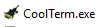

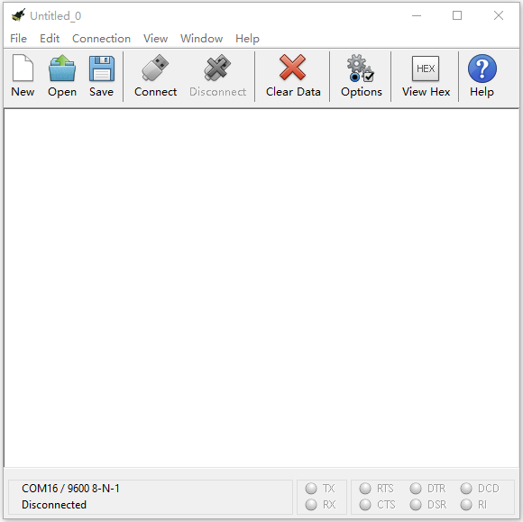

The functions of each button on the Toolbar are listed below:
<http://wiki.keyestudio.com/index.php/File:IDE.png>

|         | Opens up a new Terminal                           |
|--------------------------------------------------------|---------------------------------------------------|
|         | Opens a saved Connection                          |
|         |  Saves the current Connection to disk             |
|  | Opens the Serial Connection                       |
|  | Closes the Serial Connection                      |
|  | Clears the Received Data                          |
|  | Opens the Connection Options Dialog               |
| 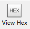 | Displays the Terminal Data in Hexadecimal Format  |
|         | Displays the Help Window                          |

##  Projects

The projects from 6.1 to 6.12 are the introduction of LED matrix and built-in
sensors on the micro:bit board

### 1: Heartbeat

1.  **Description：**

Prepare a Micro:bit board and USB cable. Next we will conduct a basic experiment
that a heartbeat pattern flashes on micro:bit board.

**2. What You Need**

1.  Connect micro:bit to computer with USB cable

2.  Open online Makecode editor

**Import Hex profile** [**(How to import?)** ](#_7.6.导入代码)

**Or click“New Project”and drag blocks step by step**

**3. Test Code：**

Import hex file.

| File Type | Route                            | File Name               |
|-----------|----------------------------------|-------------------------|
| Hex file  | ../Makecode Code/6.1：Heart beat | microbit-Heart beat.hex |

Or you could edit code step by step in the editing area.

1.  Go to“Basic”→“show icon”.

2.  Copy it again and place into“forever”block.

3.  Click“❤”to select“”.

Complete Program：

Click“JavaScript" to view the corresponding JavaScript code:

**4. Test Results:**

Download code on micro:bit and plug in it by USB cable. The LED dot matrix will
display  and

([How to download?](#A01) [How to quick download?](#_7.3.快速下载))

If download unsuccessfully, disconnect micro:bit and reboot it

### 2: Light Up A Single LED

1.  **Description：**

Micro:bit motherboard consists of 25 light-emitting diodes, 5 pcs in a group.
They correspond to x and y axis. Then the 5\*5 matrix is formed. Moreover, every
diode locates at the point of x and y axis.

Virtually, we could control an LED by setting coordinate points. For instance,
set coordinate point（0，0）to turn on the LED at row 1 and column 1; light up
LED at the row 1 and column 3, we could set （2，0) and so on.

**2. What You Need**

(1) Connect micro:bit to computer with USB cable

(2) Open online Makecode editor

**Import Hex profile** [**(How to import?)** ](#_7.6.导入代码)

**Or click “New Project”and drag blocks step by step**

**3. Test Code：**

Import hex file.

| File Type | Route                                        | File Name                       |
|-----------|----------------------------------------------|---------------------------------|
| Hex file  | ../Makecode Code/6.2: Light up a single LED  | microbit- Light up a single LED |

Or you could edit code step by step in the editing area.

1.  A. Click“Led”→“more”→“led enable false”

B. Put it into the“on start”block, click the drop-down triangle button to
select“true”.

\*\*\*\*\*\*\*\*\*\*\*\*\*\*\*\*\*\*\*\*\*\*\*\*\*\*\*\*\*\*\*\*\*\*\*\*\*\*\*\*\*\*\*\*\*\*\*\*\*\*\*\*\*\*\*\*\*\*\*\*\*\*\*\*\*\*\*\*\*\*\*\*\*\*\*\*\*

(2) A. Enter“Led”→“toggle x 0 y 0”block;

B. Combine it with“forever”，alter“x 0”into“x 1”.

\*\*\*\*\*\*\*\*\*\*\*\*\*\*\*\*\*\*\*\*\*\*\*\*\*\*\*\*\*\*\*\*\*\*\*\*\*\*\*\*\*\*\*\*\*\*\*\*\*\*\*\*\*\*\*\*\*\*\*\*\*\*\*\*\*\*\*\*\*\*\*\*\*\*\*\*\*

(3) A. Enter“Basic”→“pause (ms) 100”from“

B. Then move it below the“toggle x1 y0”block, and set to
500ms.

(4) Duplicate code stringonce and
place it into“forever”block.

\*\*\*\*\*\*\*\*\*\*\*\*\*\*\*\*\*\*\*\*\*\*\*\*\*\*\*\*\*\*\*\*\*\*\*\*\*\*\*\*\*\*\*\*\*\*\*\*\*\*\*\*\*\*\*\*\*\*\*\*\*\*\*\*\*\*\*\*\*\*\*\*\*\*\*\*\*

1.  A. Enter“Led”→“plot x 0 y 0”

B. Keep it beneath block“pause(ms)500”, then set to“plot x 3 y
4”.

\*\*\*\*\*\*\*\*\*\*\*\*\*\*\*\*\*\*\*\*\*\*\*\*\*\*\*\*\*\*\*\*\*\*\*\*\*\*\*\*\*\*\*\*\*\*\*\*\*\*\*\*\*\*\*\*\*\*\*\*\*\*\*\*\*\*\*\*\*\*\*\*\*\*\*\*\*

1.  Replicate“pause (ms) 500”once and keep it below the block“plot x3y4”

1.  

2.  Click“Led”→“unplot x 0 y 0”and set to“unplot x3 y 4”;

3.  Lay down it beneath“pause (ms) 500”block

4.  Copy“pause (ms) 500”block once, and keep it below the“unplot x3 y
    4”block.

**Complete Program：**

Click“JavaScript”to check the corresponding JavaScript code:
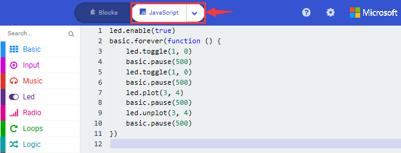

**4. Test Result：**

Upload program and plug in micro:bit via USB port, the LED at coordinate point
(1,0) flashes for 0.5s, then the LED at (3,4）blinks for 0.5s, alternately.

([How to download?](#A01) [How to quick download?](#_7.3.快速下载))

### 3: 5 x 5 LED Dot Matrix

1.  **Description：**

Dot matrix gains popularity in our life, such as LED screen, bus station and the
mini TV in the lift.

The dot matrix of Micro:bit board consists of 25 light emitting diodes. In
previous lesson, we control LED of Micro:bit board to form patterns, numbers and
character strings by setting the coordinate points. Moreover, we could adopt
another way to complete the display of patterns, numbers and character strings.

**2. What You Need**

(1) Connect micro:bit to computer with USB cable

(2) Open online Makecode editor

**Import Hex profile** [**(How to import?)** ](#_7.6.导入代码)**, or click“New
Project”and drag blocks step by step**

**3. Test Code：**

Import hex file.

**Code 1：**

Hex File:

| File Type | Route                                             | File Name           |
|-----------|---------------------------------------------------|---------------------|
| Hex file  | ../Makecode Code/6.3：5 x 5 LED dot matrix/Code-1 | microbit-Code-1.hex |

Or you could edit code step by step in the editing area.

1.  A. Enter“Led”→“more”→“led enable false”

2.  Click the drop-down triangle button to select“true”
    

3.  Combine it with“on start”block

\*\*\*\*\*\*\*\*\*\*\*\*\*\*\*\*\*\*\*\*\*\*\*\*\*\*\*\*\*\*\*\*\*\*\*\*\*\*\*\*\*\*\*\*\*\*\*\*\*\*\*\*\*\*\*\*\*\*\*\*\*\*\*\*\*\*\*\*\*\*\*\*

1.  Click“Led”to move“plot x 0 y 0”into“forever”, then replicate“plot x 0 y
    0”for 8 times, respectively set to“x 2”y 0”,“x 2”y 1”,“x 2”y 2”,“x 2”y 3”,“x
    2”y 4”,“x 1”y 3”“x 0”y 2”,“x 3”y 3”,“x 4”y 2”.

Complete Program：

Click“JavaScript" to access the corresponding JavaScript code:

**Code 2：**

Hex File:

| File Type | Route                                                 | File Name            |
|-----------|-------------------------------------------------------|----------------------|
| Hex file  | ../Makecode Code/6.3：5 x 5 LED dot matrix/Code-2.hex | microbit-Code -2.hex |

1.  A. Enter“Basic”→“show number 0”block,

2.  Duplicate it for 4 times, then separately set to“show number 1”,“show number
    2”,“show number 3”,“show number 4”,“show number 5”.

\*\*\*\*\*\*\*\*\*\*\*\*\*\*\*\*\*\*\*\*\*\*\*\*\*\*\*\*\*\*\*\*\*\*\*\*\*\*\*\*\*\*\*\*\*\*\*\*\*\*\*\*\*\*\*\*\*\*\*\*\*\*\*\*\*\*\*\*\*\*\*\*\*\*\*\*\*\*

1.  Click“Basic”→“show leds”, then put it into“forever”block，tick blue boxes to
    light LED and generate“↓”pattern.

    

\*\*\*\*\*\*\*\*\*\*\*\*\*\*\*\*\*\*\*\*\*\*\*\*\*\*\*\*\*\*\*\*\*\*\*\*\*\*\*\*\*\*\*\*\*\*\*\*\*\*\*\*\*\*\*\*\*\*\*\*\*\*\*\*\*\*\*\*\*\*\*\*\*\*\*\*\*\*

1.  Move out the block“show string” from“Basic”block, and leave it beneath
    the“show leds” block

    

Choose“show icon” from“Basic”block, and leave it beneath the block“show
string“Hello!”block

\*\*\*\*\*\*\*\*\*\*\*\*\*\*\*\*\*\*\*\*\*\*\*\*\*\*\*\*\*\*\*\*\*\*\*\*\*\*\*\*\*\*\*\*\*\*\*\*\*\*\*\*\*\*\*\*\*\*\*\*\*\*\*\*\*

1.  A. Enter“Basic”→“show arrow North”;

B. Leave it into“forever”block，replicate“show arrow North”for 3
times，respectively set to“North East”, “South East”, “South West”,“North West”.

1.  Click“Basic”to get block“clear screen”then remain it below the block “show
    arrow North West”

\*\*\*\*\*\*\*\*\*\*\*\*\*\*\*\*\*\*\*\*\*\*\*\*\*\*\*\*\*\*\*\*\*\*\*\*\*\*\*\*\*\*\*\*\*\*\*\*\*\*\*\*\*\*\*\*\*\*\*\*\*\*\*\*\*

1.  Drag“pause (ms) 100”block from“Basic”block and set to 500ms, then leave it
    below“clear screen”block.

Complete Program:

Click“JavaScript" to check the corresponding JavaScript code:

1.  **Test Result：**

Upload code 1 and plug in micro:bit via USB cable , we will see the
 icon.

Upload code 2 and plug in micro:bit via USB cable. Micro: bit starts showing
number 1, 2, 3, 4, and 5, then cyclically
display,“Hello!”,
,
,
,
 and
patterns.

([How to download?](#A01) [How to quick download?](#_7.3.快速下载))

### 4: Programmable Buttons

1.  **Description：**

The button can control the on and off of the circuit. The button is attached to
the circuit. The circuit is disconnected when the button is not pressed. The
circuit is connected as soon as it is pressed, but it is disconnected after
being released.

Both ends of button are like two mountains. There is a river in between.

The internal metal piece connect the two sides to let the current pass, just
like building a bridge to connect the two mountains.

Micro:bit board has three buttons, the reset button on the back and two
programmable buttons on the front. By pressing these buttons, the corresponding
characters will be displayed on dot matrix.

**2. What You Need**

1.  Connect micro:bit to computer with USB cable

2.  Open online Makecode editor

**Import Hex profile**[**(How to import?)** ](#_7.6.导入代码)**, or click“New
Project”and drag blocks step by step.**

**3. Test Code：**

**Code 1：**

As we press the button on micro：bit board，LED dot matrix displays character
strings.

Import hex profile

| File Type | Route                                            | File Name           |
|-----------|--------------------------------------------------|---------------------|
| Hex file  | ../Makecode Code/6.4：Programming Buttons/Code-1 | microbit-Code-1.hex |

You could edit code step by step in the editing area.

1.  A. Click“Basic”→“show string”;

B. Then place it into“on button A pressed”block,
change“Hello!”into“A”.

1.  Copy code stringonce, tap the
    drop-down button“A”to select“B”and modify
    character“A”into“B”.

\*\*\*\*\*\*\*\*\*\*\*\*\*\*\*\*\*\*\*\*\*\*\*\*\*\*\*\*\*\*\*\*\*\*\*\*\*\*\*\*\*\*\*\*\*\*\*\*\*\*\*\*\*\*\*\*\*\*\*\*\*\*\*\*\*\*\*\*\*\*\*\*\*\*\*\*\*\*

1.  Copyonce，and set to“on
    button A+B pressed”and“show string“AB”

\*\*\*\*\*\*\*\*\*\*\*\*\*\*\*\*\*\*\*\*\*\*\*\*\*\*\*\*\*\*\*\*\*\*\*\*\*\*\*\*\*\*\*\*\*\*\*\*\*\*\*\*\*\*\*\*\*\*\*\*\*\*\*\*\*\*\*\*\*\*\*\*\*\*\*\*\*\*

Complete Code:

Click“JavaScript", and you will view the corresponding JavaScript code:

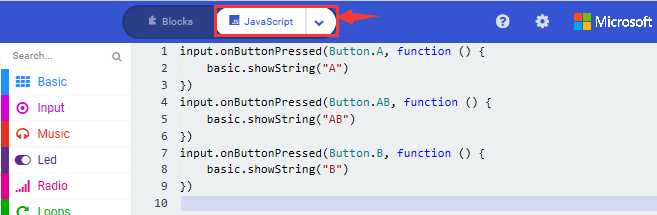

**Code 2：**

Upload code 2 and plug in board. Press button A, a row of LEDs are added and
light up, when B is pressed, a row of LEDs are deducted and go off.

Hex File:

| File Type | Route                                            | File Name           |
|-----------|--------------------------------------------------|---------------------|
| Hex file  | ../Makecode Code/6.4：Programming Buttons/Code-2 | microbit-Code-2.hex |

You could edit code step by step in the editing area.

1.  A. Click“Led”→“more”→“led enable false”,

B. Put it into the block“on start”，click drop-down triangle button to
select“true” .

\*\*\*\*\*\*\*\*\*\*\*\*\*\*\*\*\*\*\*\*\*\*\*\*\*\*\*\*\*\*\*\*\*\*\*\*\*\*\*\*\*\*\*\*\*\*\*\*\*\*\*\*\*\*\*\*\*\*\*\*\*\*\*\*\*\*\*\*\*\*\*\*\*

1.  A. Tap“Variables”→“Make a Variable...”→“New variable name：”

B. Enter“item”in the dialog box and click“OK”，then variable“item”is produced.
And move“set item to 0”into“on start”block

1.  A. Click“Input”→“on button A pressed”.

B. Go to“Variables”→“ change item by 1 ”

C. Place it into“on button A pressed”and 1 is modified into
5.

\*\*\*\*\*\*\*\*\*\*\*\*\*\*\*\*\*\*\*\*\*\*\*\*\*\*\*\*\*\*\*\*\*\*\*\*\*\*\*\*\*\*\*\*\*\*\*\*\*\*\*\*\*\*\*\*\*\*\*\*\*\*\*\*\*\*\*\*\*\*\*\*\*

1.  Duplicatecode string
    once，click the drop-down button to select“B”，then set“change item by
    \-5”.

\*\*\*\*\*\*\*\*\*\*\*\*\*\*\*\*\*\*\*\*\*\*\*\*\*\*\*\*\*\*\*\*\*\*\*\*\*\*\*\*\*\*\*\*\*\*\*\*\*\*\*\*\*\*\*\*\*\*\*\*\*\*\*\*\*\*\*\*\*\*\*\*\*\*\*\*\*\*

1.  A. Enter“Led”→“plot bar graph of 0 up to 0”

B. Keep it into“forever”block

C. Go to“Variables”to move“item”into 0 box，change 0 into 25.

\*\*\*\*\*\*\*\*\*\*\*\*\*\*\*\*\*\*\*\*\*\*\*\*\*\*\*\*\*\*\*\*\*\*\*\*\*\*\*\*\*\*\*\*\*\*\*\*\*\*\*\*\*\*\*\*\*\*\*\*\*\*\*\*\*\*\*\*\*\*\*\*\*\*\*\*\*

1.  A. Go to“Logic”to move out “if...true...then...”and “=”blocks，

B. Keep“=”into“true”box and set to “\>”

C. Select“item”in the“Variables”and lay it down at left box of “\>”，change 0
into 25；

D. Enter“Variables”to drag“set item to 0”block into“if...true..then...”, alter 0
into 25.

\*\*\*\*\*\*\*\*\*\*\*\*\*\*\*\*\*\*\*\*\*\*\*\*\*\*\*\*\*\*\*\*\*\*\*\*\*\*\*\*\*\*\*\*\*\*\*\*\*\*\*\*\*\*\*\*\*\*\*\*\*\*\*\*\*\*\*\*\*\*\*\*\*\*\*\*\*\*

(7) A. Replicate code string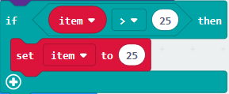once

B.“\>”is modified into“\<”and 25 is changed into 0,

C. Leave it beneath code string.

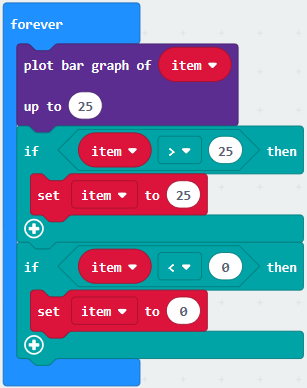

Complete Program：

Click“JavaScript" to switch into JavaScript code:

1.  **Test Result：**

Upload code 1 and plug in micro:bit via USB cable, press“A”on Micro:bit board,
character“A”will be displayed；in case that B is pressed，letter“B”will appear.
So will show“AB”if you press A and B buttons simultaneously.

Upload code 2 and plug in board via USB cable. Press button A, a row of LEDs are
added, when B is pressed, a row of LEDs are deducted.

([How to download?](#A01) [How to quick download?](#_7.3.快速下载))

### 5: Temperature Measurement

1.  **Description：**

Micro:bit main board doesn’t come with temperature sensor actually, but detect
temperature through built-in temperature of nRF52833 chip. Thereby, the detected
temperature is more close to chip’s temperature.

**Note: the temperature sensor of Micro:bit main board is shown below:**

**2. What You Need**

(1) Connect micro:bit to computer with USB cable

(2) Open online Makecode editor

**Import Hex profile**[**(How to import?)** ](#_7.6.导入代码)**, or click“New
Project”and drag blocks step by step**

**3. Test Code：**

**Code 1：**

Micro:bit detects temperature

Import hex file.

| File Type | Route                                                 | File Name           |
|-----------|-------------------------------------------------------|---------------------|
| Hex file  | ../Makecode Code/6.5：Temperature Measurement /Code-1 | microbit-Code-1.hex |

Or you could edit code step by step in the editing area.

1.  Go to“Advanced” →“Serial” →“serial redirect to USB”

Place it into “on start”

\*\*\*\*\*\*\*\*\*\*\*\*\*\*\*\*\*\*\*\*\*\*\*\*\*\*\*\*\*\*\*\*\*\*\*\*\*\*\*\*\*\*\*\*\*\*\*\*\*\*\*\*\*\*\*\*\*\*\*\*\*\*\*\*\*\*\*\*\*\*\*\*\*\*\*\*\*

1.  Click“Serial”to drag out“serial write value x=0”

2.  Move it into“forever”block

    

1.  Go to“Input” →“temperature(℃)”

Place it into 0 box

Change x into Temperature

\*\*\*\*\*\*\*\*\*\*\*\*\*\*\*\*\*\*\*\*\*\*\*\*\*\*\*\*\*\*\*\*\*\*\*\*\*\*\*\*\*\*\*\*\*\*\*\*\*\*\*\*\*\*\*\*\*\*\*\*\*\*\*\*\*\*\*\*\*\*\*\*\*\*\*\*\*

1.  Move “pause (ms) 100”from“Basic” block and place it under block“serial
    write.....temperature(℃)”

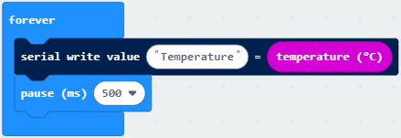

Complete Program：

Click“JavaScript" to view the corresponding JavaScript code:

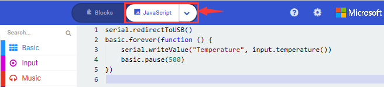

Download code 1 to micro:bit board and keep USB cable connected, then tap button
:

( [How to quick download?](#_7.3.快速下载))

Temperature data is shown below:

Through the test, the room temperature is 35℃ when touching the nRF52833 chip of
micro:bit; however, the temperature rise to 37℃ when it touches water cup.

Open CoolTerm, click Options to select SerialPort. Set COM port and 115200 baud
rate(the baud rate of USB serial communication of Micro:bit is 115200 through
the test). Click“OK”and“Connect”.

The serial monitor shows the current ambient temperature value, as shown below:

**Code 2：**

Control micro:bit to display different patterns via temperature**(Note: the
temperature value in the code can be adjusted)**

Hex File:

| File Type | Route                                                 | File Name            |
|-----------|-------------------------------------------------------|----------------------|
| Hex file  | ../Makecode Code/6.5：Temperature Measurement /Code-2 | microbit-/Code-2.hex |

You could set temperature based on real situation.

1.  Click“Led”→“more”→“led enable false”into“on start”，click drop-down triangle
    button to select“true” 

\*\*\*\*\*\*\*\*\*\*\*\*\*\*\*\*\*\*\*\*\*\*\*\*\*\*\*\*\*\*\*\*\*\*\*\*\*\*\*\*\*\*\*\*\*\*\*\*\*\*\*\*\*\*\*\*\*\*\*\*\*\*\*\*\*

1.  A. Go to“Logic”→“if..true...then...else”and “=” block;

B. Move“if..true...then...else” into“forever”block，then place“=”into“true”box.

\*\*\*\*\*\*\*\*\*\*\*\*\*\*\*\*\*\*\*\*\*\*\*\*\*\*\*\*\*\*\*\*\*\*\*\*\*\*\*\*\*\*\*\*\*\*\*\*\*\*\*\*\*\*\*\*\*\*\*\*\*\*\*\*\*\*\*\*\*\*\*\*\*\*\*\*\*\*

1.  A. Change “=” into“≥”

B. Go to“Input”→“temperature(℃)”and move it into left 0 box;

C. Change 0 into 35.

\*\*\*\*\*\*\*\*\*\*\*\*\*\*\*\*\*\*\*\*\*\*\*\*\*\*\*\*\*\*\*\*\*\*\*\*\*\*\*\*\*\*\*\*\*\*\*\*\*\*\*\*\*\*\*\*\*\*\*\*\*\*\*\*\*

1.  Tap“Basic”→“show icon”，copy it once and lay down them under the“if ...then”
    and else blocks, then click the drop-down triangle button to
    select“”.
    

Complete Program：

Click“JavaScript", the corresponding JavaScript code is shown below:

1.  **Test Result：**

Upload the Code 1 and plug in power. And 5\*5LED displays the ambient
temperature. When pressing the temperature sensor, the temperature will grow on
dot matrix.

Upload the code 2 plug in micro:bit via USB cable, when the ambient temperature
is less than 35℃, 5\*5LED will
show. When the temperature is
equivalent to or greater than 35℃, the
pattern will appear.

([How to download?](#A01) [How to quick download?](#_7.3.快速下载))

### 6: Micro:bit’s Compass

**1. Description：**

This project aims to explain the use of the Micro: bit geomagnetic sensor, which
can not only detect the strength of the geomagnetic field, but also be used as a
compass to find bearings. It is also an important part of the navigation
attitude reference system (AHRS). Micro: Bit main board V2 uses LSM303AGR
geomagnetic sensor, and the dynamic range of magnetic field is ±50 gauss. In the
board, the magnetometer module is used in both magnetic detection and compass.
In this experiment, the compass will be introduced first, and then the original
data of the magnetometer will be checked.The main component of a common compass
is a magnetic needle, which can be rotated by the geomagnetic field and point
toward the geomagnetic North Pole (which is near the geographic South Pole) to
determine direction.

Then we could read the value detected by it to determine the location. We need
to calibrate the Micro:bit board when the magnetic sensor works.

The correct calibration method is to rotate the Micro:bit board.

In addition, the objects nearby may affect the accuracy of readings and
calibration.

**2. What You Need**

(1) Connect micro:bit to computer with USB cable

(2) Open online Makecode editor

**Import Hex profile**[**(How to import?)** ](#_7.6.导入代码)**, or click“New
Project”and drag blocks step by step.**

**3. Test Code：**

**Code 1：**

The micro:bit board shows the value of magnetic sensor when pressing A

Hex File:

Import hex file

| File Type | Route                                            | File Name           |
|-----------|--------------------------------------------------|---------------------|
| Hex file  | ../Makecode Code/6.6：micro:bit’s compass/Code-1 | microbit-Code-1.hex |

Or you could edit code step by step in the editing area.

1.  A. Click“Input”→“more”→“calibrate compass”

B. Lay down it into block“on start”.

1.  A. Go to“Input”→“on button A pressed”.

B. Enter“Basic”→“show number”, put it into“on button A pressed”block;

C. Tap“Input”→“compass heading(℃)”， and place it into“show number”

\*\*\*\*\*\*\*\*\*\*\*\*\*\*\*\*\*\*\*\*\*\*\*\*\*\*\*\*\*\*\*\*\*\*\*\*\*\*\*\*\*\*\*\*\*\*\*\*\*\*\*\*\*\*\*\*\*\*\*\*\*\*\*\*\*\*\*\*\*\*\*\*\*\*\*

Complete Program：

Click“JavaScript",
and view the corresponding JavaScript code:

**Code Description：**

Upload the code 1, plug in micro:bit via USB cable and press button A. LED dot
matrix indicates that“TILT TO FILL SCREEN”. Then enter the calibration
interface, the calibration method is: rotate the Micro:bit motherboard to make
the screen (LED dot matrix) draw a square (25 LEDs are on), as shown in the
following figure:

([How to download?](#A01) [How to quick download?](#_7.3.快速下载))

The calibration is finished until you view the smile
patternappear.

The serial monitor show will 0°, 90°, 180°and 270° when pressing A.

**Code 2：**

Make micro: bit board point to the north, south, east and west horizontally ,
LED dot matrix displays the corresponding direction patterns

| File Type | Route                                            | File Name           |
|-----------|--------------------------------------------------|---------------------|
| Hex file  | ../Makecode Code/6.6：Micro:bit’s compass/Code-2 | microbit-Code-2.hex |

This code string complies that we read the value detected incessantly and
determine the direction by the value range. The direction is toward North at
this time.

1.  

2.  Enter“Input”→ “more”→“calibrate compass”

3.  Move“calibrate compass”into“on start”

\*\*\*\*\*\*\*\*\*\*\*\*\*\*\*\*\*\*\*\*\*\*\*\*\*\*\*\*\*\*\*\*\*\*\*\*\*\*\*\*\*\*\*\*\*\*\*\*\*\*\*\*\*\*\*\*\*\*\*\*\*\*\*\*\*\*\*\*\*\*\*\*\*\*\*\*\*

1.  A. Click“Variables”→“Make a Variable...”→“New variable name：”

B. Input“x”in the blank box and click“OK”, and the variable“x” is generated.

C. Drag out“set x to”into“forever”block

1.  A. Go to“Input”→“compass heading(℃)”, and keep it into “0” box

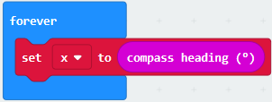

1.  Tap“Logic”→“if...then...else”, leave it below block“sex x to compass
    heading”，then clickicon for
    6 times.

1.  A. Place“and”into “true” block

B. Then move“=”block to the left box of “and”

C. Click“Variables”to drag“x”to the left“0”box, change 0 into 293 and set to“≥”;

D. Then copy“x≥293”once and leave it to the right“0”box and set to“x\<338”

\*\*\*\*\*\*\*\*\*\*\*\*\*\*\*\*\*\*\*\*\*\*\*\*\*\*\*\*\*\*\*\*\*\*\*\*\*\*\*\*\*\*\*\*\*\*\*\*\*\*\*\*\*\*\*\*\*\*\*\*\*\*\*\*\*\*\*\*\*\*\*\*\*\*

1.  A. Go to“Basic”→“show leds”

B. Lay it down beneath block,
then click“show leds”and the pattern
appears.

1.  A. Duplicate for 6 times.

B. Separately leave them into the blank boxes behind“else if”.

C. Set to“x≥23 and x\<68 ”,“x≥68 and x\<113 ”,“x≥113 and x\<158 ”,“x≥158 and
x\<203 ”,“x≥203 and x\<248”,“x≥248 and x\<293 ”respectively.

D. Then copy“show leds”for 7 times and keep them below the“else if.......then”
block respectively.

E. Click the blue boxes to form the
pattern“”,
“”,
“”,
“”,
“”,
“”.

Complete Program：

pattern appears

 When x is not among the above rang, the next program will be executed under else block

Click“JavaScript", you will view the corresponding JavaScript code:

1.  **Test Result：**

Upload code 2 and keep USB cable connected. After calibration, tilt Micro:bit
board, the LED dot matrix displays the direction signs

([How to download?](#A01) [How to quick download?](#_7.3.快速下载))

### 7: Accelerometer

**1. Description：**

The Micro: Bit main board V2 has a built-in LSM303AGR gravity acceleration
sensor, also known as accelerometer, with a resolution of 8/10/12 bits. The code
section sets the range to 1g, 2g, 4g, and 8g.

We often use accelerometer to detect the status of machines.

In this project, we will introduce how to measure the position of the board with
the accelerometer. And then have a look at the original three-axis data output
by the accelerometer.

**2. What You Need**

(1) Connect micro:bit to computer with USB cable

(2) Open online Makecode editor

**Import Hex profile** [**(How to import?)** ](#_7.6.导入代码)**, or click“New
Project”and drag blocks step by step**

**3. Test Code：**

**Code 1：**

Control micro: bit board to make LED dot matrix will show different numbers.

Import hex file

| File Type | Route                                      | File Name           |
|-----------|--------------------------------------------|---------------------|
| Hex file  | ../Makecode Code/6.7：Accelerometer/Code-1 | microbit-Code-1.hex |

Or you could edit code step by step in the editing area.

(1) A. Enter“Input”→“on shake”，

B. Click“Basic”→“show number”, place it into“on shake”block, then change 0 into
1.

(2) A. Copy code string for 7
times;

1.  separately click the triangle button to select“logo up”,“logo down”,“screen
    up”,“screen down”,“tilt left”,“tilt right”and“free fall”, then respectively
    change 1 into 2, 3, 4, 5, 6, 7, 8.

\*\*\*\*\*\*\*\*\*\*\*\*\*\*\*\*\*\*\*\*\*\*\*\*\*\*\*\*\*\*\*\*\*\*\*\*\*\*\*\*\*\*\*\*\*\*\*\*\*\*\*\*\*\*\*\*\*\*\*\*\*\*\*\*\*\*\*\*\*\*\*\*\*\*\*\*\*\*

Complete Program：

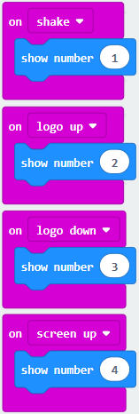

Click“JavaScript", you will view the corresponding JavaScript code:

**Code 2：**

Check the acceleration value at X, Y and Z axis.

| Hex File:File Type | Route                                      | File Name           |
|--------------------|--------------------------------------------|---------------------|
| Hex file           | ../Makecode Code/6.7：Accelerometer/Code-2 | microbit-Code-2.hex |

1.  A. Go to“Advanced”→“Serial”→“serial redirect to USB”

B. Drag it into“on start”

\*\*\*\*\*\*\*\*\*\*\*\*\*\*\*\*\*\*\*\*\*\*\*\*\*\*\*\*\*\*\*\*\*\*\*\*\*\*\*\*\*\*\*\*\*\*\*\*\*\*\*\*\*\*\*\*\*\*\*\*\*\*\*\*\*\*\*\*\*\*\*\*\*\*\*\*\*\*

1.  A. Enter“Serial”→“serial write value x =0”

B. Leave it into“forever”block

1.  \*\*\*\*\*\*\*\*\*\*\*\*\*\*\*\*\*\*\*\*\*\*\*\*\*\*\*\*\*\*\*\*\*\*\*\*\*\*\*\*\*\*\*\*\*\*\*\*\*\*\*\*\*\*\*\*\*\*\*\*\*\*\*\*\*\*\*\*\*\*\*\*\*\*\*\*\*
    A. Click“Input”→“acceleration(mg) x”；

B. Keep it into“0”box and capitalize the“x”

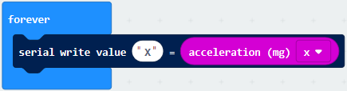

\*\*\*\*\*\*\*\*\*\*\*\*\*\*\*\*\*\*\*\*\*\*\*\*\*\*\*\*\*\*\*\*\*\*\*\*\*\*\*\*\*\*\*\*\*\*\*\*\*\*\*\*\*\*\*\*\*\*\*\*\*\*\*\*\*\*\*\*\*\*\*\*\*\*\*\*\*

1.  Go to“Basic”and move out“pause (ms) 100”below the
    block, then set to 100ms.

    

\*\*\*\*\*\*\*\*\*\*\*\*\*\*\*\*\*\*\*\*\*\*\*\*\*\*\*\*\*\*\*\*\*\*\*\*\*\*\*\*\*\*\*\*\*\*\*\*\*\*\*\*\*\*\*\*\*\*\*\*\*\*\*\*\*\*\*\*\*\*\*\*\*\*\*\*\*

1.  Replicate code string

for 3 times and keep them into“forever”block，separately set the whole code
string as follows:

Complete Program：

Click“JavaScript" to view the corresponding JavaScript code:

Download code 1 to micro:bit board, keep USB cable connected and
click

([How to quick download?](#_7.3.快速下载))

The coordinates of the Micro:bit accelerometer are shown in the following
figure:

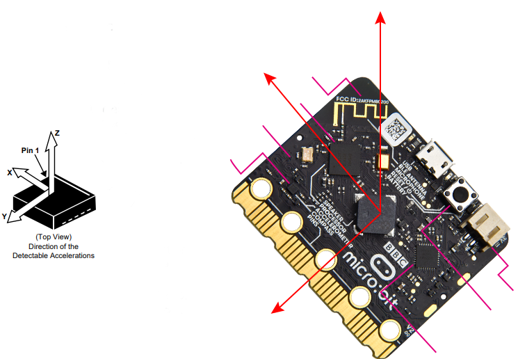

The decomposition of acceleration on the X-axis, Y-axis, and Z-axis, as well as
the synthesis of acceleration (the synthesis of gravitational acceleration and
other external forces). Then flip the micro:bit board, the data is shown below:

1.  **Test Results：**

Uploading the test code 1 to micro:bit main board V2 and powering the board via
the USB cable, if we shake the Micro: Bit main board V2. no matter at any
direction, the LED dot matrix displays the digit “1”.

When it is kept upright （its logo above the LED dot matrix）, the number 2 will
show.

When it is kept upside down( its logo below the LED dot matrix) , it will show
as below.

When it is placed still on the desk, showing its front side, the number 4
appears.

When it is placed still on the desk, showing its back side, the number 5 will
exhibit.

When the board is tilted to the left , the LED dot matrix shows the number 6 as
shown below.

When the board is tilted to the right , the LED dot matrix displays the number 7
as shown below

When the board is knocked to the floor, this process can be considered as a free
fall and the LED dot matrix shows the number 8. (please note that this test is
not recommended for it may damage the main board.)

Attention: if you’d like to try this function, you can also set the acceleration
to 3g, 6g or 8g. But still ,we don not recommend.

### 8: Detect Light Intensity by Micro:bit

1.  **Description：**

This project will introduce how Micro:bit detects the external light intensity.
Since Micro:bit doesn’t come with photosensitive sensor, the detection of light
intensity is completed through the LED matrix. When the light irradiates the LED
matrix, the voltage change will be produced. Therefore, we could determine the
light intensity by voltage change.

**2. What You Need**

(1) Connect micro:bit to computer with USB cable

(2) Open online Makecode editor

**Import Hex profile** [**(How to import?)** ](#_7.6.导入代码)**, or click“New
Project”and drag blocks step by step.**

**3. Test Code：**

Import hex file

| File Type | Route                                                     | File Name                                        |
|-----------|-----------------------------------------------------------|--------------------------------------------------|
| Hex file  | ../Makecode Code/6.8：Detect Light Intensity by Micro:bit | microbit-Detect Light Intensity by Micro:bit.hex |

Or you could edit code step by step in the editing area.

(1)A. Enter“Advanced”→“Serial”→“serial redirect to USB”;

B. Drag it into“on start”block.

\*\*\*\*\*\*\*\*\*\*\*\*\*\*\*\*\*\*\*\*\*\*\*\*\*\*\*\*\*\*\*\*\*\*\*\*\*\*\*\*\*\*\*\*\*\*\*\*\*\*\*\*\*\*\*\*\*\*\*\*\*\*\*\*\*\*\*\*\*\*\*\*\*\*\*

(2) A. Go to“Serial”→“serial write value x =0”;

B. Move it into“forever”

1.  A. Click“Input”→“acceleration(mg) x”

B. Put“acceleration(mg) x”in the“0”box and change “x”into“Light intensity”.

\*\*\*\*\*\*\*\*\*\*\*\*\*\*\*\*\*\*\*\*\*\*\*\*\*\*\*\*\*\*\*\*\*\*\*\*\*\*\*\*\*\*\*\*\*\*\*\*\*\*\*\*\*\*\*\*\*\*\*\*\*\*\*\*\*\*\*\*\*\*\*\*\*\*\*

1.  A. Click“Basic”→“pause (ms) 100”;

B. Lay it down into“forever”and set to 100ms.

\*\*\*\*\*\*\*\*\*\*\*\*\*\*\*\*\*\*\*\*\*\*\*\*\*\*\*\*\*\*\*\*\*\*\*\*\*\*\*\*\*\*\*\*\*\*\*\*\*\*\*\*\*\*\*\*\*\*\*\*\*\*\*\*\*\*\*\*\*\*\*\*\*\*\*

Complete Program：

Click“JavaScript", you will view the corresponding JavaScript code:

**4. Test Results：**

Download code to micro:bit board don’t plug off USB cable and
click

([How to quick download?](#_7.3.快速下载))

The intensity value is 0 when covering LED dot matrix. And it varies with the
light intensity when placing micro:bit board under the sunlight. The stronger
the light is, the larger the intensity value is.

Open CoolTerm, click Options to select SerialPort. Set COM port and 115200 baud
rate(the baud rate of USB serial communication of Micro:bit is 115200 through
the test). Click“OK”and“Connect”.

CoolTerm serial monitor displays the light intensity.

### 9: Speaker

1.  Description：

The Micro: Bit main board V2 has an built-in speaker, which makes adding sound
to the programs easier. We can program the speaker to air all kinds of tones .

1.  Preparation：

2.  Attach the micro:bit to your computer

3.  Enter the online Makecode editor

**Import Hex profile** [**(How to import?)** ](#_7.6.导入代码)**, or click“New
Project”and drag blocks step by step**

1.  Test Code：

| Type     | Path                          | File Name            |
|----------|-------------------------------|----------------------|
| Hex file | ../Makecode Code/6.9：Speaker | microbit-Speaker.hex |

1.  Go to“Basic”to move out the block“show icon”into block“on start”，and click
    the triangle button to
    select“”.

1.  Click“Music”to move block“play sound giggle until done”into the
    “forever”block.

Enter“Basic”to get block“pause(ms) 100”and place it into“forever”

Change 100 into 1000.

1.  Copy code stringfor three
    times and place into“forever”，and click triangle buttons to
    set“happy”,“hello”and “yawn”.

Complete Code

The program under the block“forever”runs cyclically. Buzzer emits a“giggle”sound delay in 1000ms Buzzer emits a“happy”sound .delay in 1000ms Buzzer emits a“hello”sound delay in 1000ms Buzzer emits a“yawn”sound delay in 1000ms

Click“JSJavaScript”to switch into JavaScript language code：

1.  **Test Results:**

Download code to the micro:bit and plug it to the power. Then it will emit a
sound and display a music sign.

([How to download?](#A11) [How to quick download?](#A12))

### 10: Touch Sensitive Logo

1.  **Description：**

The Micro: Bit main board V2 is equipped with a golden touch-sensitive logo,
which can act as an input component and function like an extra button.

It contains a capacitive touch sensor that senses small changes in the electric
field when pressed (or touched), just like your phone or tablet screen do.When
you press it , you can activate the program.

1.  **Preparation：**

2.  Attach the micro:bit to your computer

3.  Enter the online Makecode editor

**Import Hex profile** [**(How to import?)** ](#_7.6.导入代码)**, or click“New
Project”and drag blocks step by step**

1.  **Test Code：**

| Type     | Path                                        | File Name                         |
|----------|---------------------------------------------|-----------------------------------|
| Hex file | ../Makecode Code/6.10：Touch Sensitive Logo | microbit-Touch Sensitive Logo.hex |

1.  Delete“on start”and“forever”

2.  Enter“Input”to drag the“on logo pressed”block and click the triangle buttons
    to set **touched.**

1.  Tap“Variables”\> ”Make a Variable”，and input **start** and click **OK**

The variable“start”is created. Click “Variables” t move “set start to 0” into
the block“on logo touched”

1.  Click“Input”\> more，and drag out the block“running time(ms)”into the 0 box
    of“set start to 0”

1.  Go to“Basic”to move block“show icon❤”into“on logo touched”

1.  Go to block“Input”to drag block“on logo pressed”and select **released**，and
    create the variable“time”in same way.

2.  Enter“Variables”to drag out the block “set time to 0” into “on logo
    pressed”.

3.  Enter block“Math”to move block“0-0”into the o box of block“set time to 0”.

1.  Click“Input”\> more，move block“running time(ms)”into the left 0 box.

2.  Enter the block“Variables”to move block “start”into the right 0 box.

1.  Drag“show number”from the“Basic”block and leave it underneath the
    block“set....start”.

2.  Go to“Math”block to move the block“square root 0”into 0 box and click the
    triangle button to integer÷ .

1.  Enter“Variables”block and drag“time”to the left 0 box

Change 0 at the right into 1000

Complete Code：

Click“JSJavaScript”to switch into JavaScript language：

**4.Test Results:**

Download test code to the micro:bit, plug in power.

Touch the logo, then LED will show“❤”image；and if the logo is not touched，the
number will appear.

([How to download?](#A11) [How to quick download?](#A12))

### 11: Microphone

1.  **Description：**

The Micro: Bit main board V2 is built with a microphone which can test the
volume of ambient environment. When you clap, the microphone LED indicator will
turn on. Since it can measure the intensity of sound, you can make a noise scale
or disco lighting changing with music. The microphone is placed on the opposite
side of the microphone LED indicator and in proximity with holes that lets sound
pass.When the board detects sound, the LED indicator lights up.

1.  **Preparation：**

2.  Attach the micro:bit to your computer

3.  Enter the online Makecode editor

**Import Hex profile** [**(How to import?)** ](#_7.6.导入代码)**, or click“New
Project”and drag blocks step by step**

1.  **Test Code：**

| Type     | Path                                     | File Name                 |
|----------|------------------------------------------|---------------------------|
| Hex file | ../Makecode Code/6.11：Microphone/Code-1 | microbit-Microphone-1.hex |

1.  Delete“on start”and“forever”.

2.  Click“Input”to drag out the block“on loud sound”,

Go to“Basic”to move out the block“show number”

Edit the code string as follows:

1.  Duplicate the code
    stringonce，click **loud** to
    set to **quiet**，and tap ❤ to select
    

Complete Code

”

Click“JSJavaScript”to switch into JavaScript language：

**4.Test Results 1：**

Download code1 to the micro:bit and plug in power. The micro:bit will show“❤”if
you clap your hands; if not, the
image“”will be displayed.

([How to download?](#A11) [How to quick download?](#A12))

1.  **Test Code2:**

| Type     | Path                                     | File Name                  |
|----------|------------------------------------------|----------------------------|
| Hex file | ../Makecode Code/6.11：Microphone/Code-2 |  microbit-Microphone-2.hex |

1.  Click“Advanced”\>“Serial”, move block“serial redirect to USB”into“on start”

1.  Tap“Variables”\>“Make a Variable”, input **maxSound** and click **OK**，The
    the variable“maxSound”is produced.

2.  Move out the block“set maxSound to 0”from the“Variables” and place it as
    follows:

1.  Click“Logic”to move the block“if true then...else”into“forever”，Go to the
    block“Input”to drag the block“button A is pressed”and place it as follows:

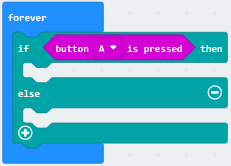

1.  Go to the block“Basic”to get the block“show number”

2.  Enter “Variables”to get the block“maxSound”

Place them as follows:

1.  Then we create the variable“soundLevel”

Go to the block“Variables”to get the block“set soundLevel to 0”

Click“Input”to get“sound level”

Place them as follows:

1.  Tap“Led”to drag“plot bar graph of 0 up to 0”underneath the
    block“set....level”

Enter“Variables”to get the block“soundLevel”

Then place them as follows and change 0 into 255.

1.  Go to“Logic”to drag the block“if true then”and“0 \> 0”

Enter“Variables”to get“soundLevel”and“maxSound”

Then Place these blocks as follows:

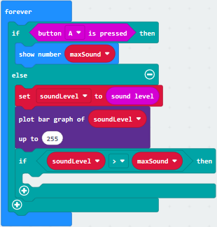

1.  Go to“Variables”to move“set maxSound to 0”and“soundLevel”

Edit these blocks as follows:

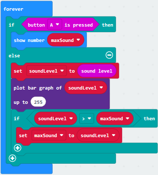

**Complete Code**

Click“JSJavaScript”to switch into JavaScript language：

1.  **Test Result2：**

Download test code2 to the micro:bit and plug in power and click **Show console
device**

( [How to quick download?](#A12))

When the sound amplifies, the output sound value will increase as well, as shown
below:

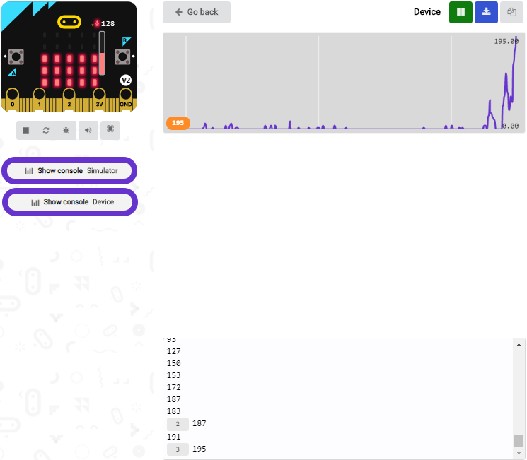

When the button A is pressed, LED will show the detected maximum sound value and
when you clap your hands, the LED matrix will a show bar graph.

### 12: Bluetooth Wireless Communication

1.  **Description：**

The Micro: Bit main board V2 comes with a nRF52833 processor (with built-in
Bluetooth 5.1 BLE(Bluetooth Low Energy) device) and a 2.4GHz antenna for
Bluetooth wireless communication and 2.4GHz wireless communication. With the
help of them, the board is able to communicate with a variety of Bluetooth
devices, including smart phones and tablets.

In this project, we mainly concentrate on the Bluetooth wireless communication
function of this main board. Linked with Bluetooth, it can transmit code or
signals. To this end, we should connect an Apple device (a phone or an iPad) to
the board.

Since setting up Android phones to achieve wireless transmission is similar to
that of Apple devices, no need to illustrate again.

**2. What You Need**

-   Link micro:bit board with computer by USB cable.

-   iOS system(cellphone or iPad) or Android system

**iOS System**

Navigate website：<https://www.microbit.org/get-started/user-guide/ble-ios/> ,
click“**Download pairing HEX file**”to download micro:bit’s firmware into the
created folder or place it on the desktop and burn it to the micro:bit.

Search“Micro:bit”in APP store and install it, as shown below:

Connect the Micro:bit to App

Enable the Bluetooth of your cellphone

a. Enter app, attach the
micro:bit to computer with USB cable, and tap“Choose Micro:bit”to start
Bluetooth pairing.

b. Click“Pair a new Micro:bit”

c. Hold down button A and B, press and the reset button at the other side of the
micro:bit then release it. LED dot matrix will show a password image. At last,
release the button A and B at same time and click“Next”.

Design the password image on the cellphone and click“Next”.

e. Click“Next”and pair. After pairing successfully, LED dot matrix will
display“√”image.

After connecting successfully, design code via APP .

f. Select“Create Code”,
clickand appear the dialog
box，and click
iconto enter the programming
interface.

Name your project(we set to 1) and
click“”

After saving the code, click“Flash”to enter the code uploading page.

Tap“Flash”to upload the code“1”

At last, LED dot matrix will show the heartbeat image.

From project 1 to 12, we’ve introduced the micro:bit’s components. In the
further lessons, we will conduct some expansion experiments

Disconnect the power between the micro:bit and expansion board(slide POWER to
OFF end) to avoid damaging the micro:bit.

### 13: Passive Buzzer

**1. Description：**

We can use Micro:bit board to make many interactive works of which the most
commonly used is acoustic-optic display. The previous lessons are related to
LED. However, we will elaborate the Sound in this lesson.

Buzzer is inclusive of active buzzer and passive buzzer.

The passive buzzer doesn’t carry with vibrator inside, so it need external sine
or square wave to drive. It can produce slight sound when connecting directly to
power supply. It features controlling sound frequency and producing the sound
of“do re mi fa so la si”.

A diode should be connected in reverse when driving by the square wave signal
source, which will hinder the high-voltage generated to damage other components
or service life when the power breaks down.

Frequency is made of a series of pitch names in English letters and Numbers. You
can choose different frequencies, that is, tone. The frequency of sound is
called pitch.

It involves music knowledge. In music lesson, our teacher taught“1（Do）,
2（Re）, 3(Mi), 4(Fa) , 5(Sol), 6(La), 7(Si)”

| 1（Do） | 2（Re） | 3(Mi) | 4(Fa) | 5(Sol) | 6(La) | 7(Si) |
|---------|---------|-------|-------|--------|-------|-------|
| C       | D       | E     | F     | G      | A     | B     |

The number depends on high or low tone. The larger the number, the higher the
tone. When the number is same, the frequency (tone) is getting higher and higher
from C to \_B.

Beats are the time delay for each note. The larger the number, the longer the
delay time. A note without a line in the spectrum is a beat, with a delay of
1000 milliseconds. while a beat with an underline is 1/2 of a beat without a
line, and a beat with two underlines is 1/4 of a beat without a line.

（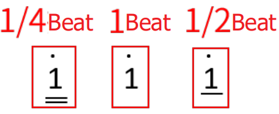）

Here is the notation of Ode to Joy.

**2. What You Need**

1.  Insert micro:bit board into slot of V2 shield..

2.  Place batteries into battery holder.

3.  Plug smart car in power.

**Link with computer by USB cable and enter online micro:bit editor.**

**Import Hex profile**[**(How to import?)** ](#_7.6.导入代码)**, or click “New
Project”and drag blocks step by step.**

1.  **Test Code：**

Import hex file

| File Type | Route                                 | File Name               |
|-----------|---------------------------------------|-------------------------|
| Hex file  | ../Makecode Code/6.13：Passive Buzzer | microbit-Play music.hex |

Or you could edit code step by step in the editing area.

1.  Click “Led”→”more”→“led enable false”, combine it with“on
    start”.

\*\*\*\*\*\*\*\*\*\*\*\*\*\*\*\*\*\*\*\*\*\*\*\*\*\*\*\*\*\*\*\*\*\*\*\*\*\*\*\*\*\*\*\*\*\*\*\*\*\*\*\*\*\*\*\*\*\*\*\*\*\*\*\*\*\*\*\*\*\*\*\*\*

1.  Enter“Music”→“play tone Middle C for 1 beat”， leave it
    into“forever”block，then tap “Middle C”, then
    appearcode.

Choose“High E”and set to“1 beat”.

.

Duplicate“play tone High E for 1 beat”for 124 times and click“High E”and“1 beat”

To set up as follows:

| \#  | tone     | beat | \#  | tone     | beat | \#  | tone     | beat | \#  | tone     | beat |
|-----|----------|------|-----|----------|------|-----|----------|------|-----|----------|------|
| ①   | High E   | 1    | ②   | High F   | 1    | ③   | High G   | 1    | ④   | High G   | 1    |
| ⑤   | High F   | 1    | ⑥   | High E   | 1    | ⑦   | High D   | 1    | ⑧   | High C   | 1    |
| ⑨   | High C   | 1    | ⑩   | High D   | 1    | ⑪   | High E   | 1    | ⑫   | High E   | 1    |
| ⑬   | High D   | 1/2  | ⑭   | High D   | 1    | ⑮   | High E   | 1    | ⑯   | High E   | 1    |
| ⑰   | High F   | 1    | ⑱   | High G   | 1    | ⑲   | High G   | 1    | ⑳   | High F   | 1    |
| ㉑  | High E   | 1    | ㉒  | High D   | 1    | ㉓  | High C   | 1    | ㉔  | High C   | 1    |
| ㉕  | High D   | 1    | ㉖  | High E   | 1    | ㉗  | High D   | 1    | ㉘  | High C   | 1/2  |
| ㉙  | High C   | 1    | ㉚  | High D   | 1    | ㉛  | High D   | 1    | ㉜  | High E   | 1    |
| ㉝  | High C   | 1    | ㉞  | High D   | 1    | ㉟  | High E   | 1/2  | ㊱  | High F   | 1/2  |
| ㊲  | High E   | 1    | ㊳  | High C   | 1    | ㊴  | High D   | 1    | ㊵  | High E   | 1/2  |
| ㊶  | High F   | 1/2  | ㊷  | High E   | 1    | ㊸  | High D   | 1    | ㊹  | High C   | 1    |
| ㊺  | High D   | 1    | ㊻  | Middle G | 1    | ㊼  | High E   | 1    | ㊽  | High E   | 1    |
| ㊾  | High E   | 1    | ㊿  | High F   | 1    | 51  | High G   | 1    | 52  | High G   | 1    |
| 53  | High F   | 1    | 54  | High E   | 1    | 55  | High D   | 1    | 56  | High C   | 1    |
| 57  | High C   | 1    | 58  | High D   | 1    | 59  | High E   | 1    | 60  | High D   | 1    |
| 61  | High C   | 1/2  | 62  | High C   | 1    | 63  | High D   | 1    | 64  | High D   | 1    |
| 65  | High E   | 1    | 66  | High C   | 1    | 67  | High D   | 1    | 68  | High E   | 1/2  |
| 69  | High F   | 1/2  | 70  | High E   | 1    | 71  | High C   | 1    | 72  | High D   | 1    |
| 73  | High E   | 1/2  | 74  | High F   | 1/2  | 75  | High E   | 1    | 76  | High D   | 1    |
| 77  | High C   | 1    | 78  | High D   | 1    | 79  | Middle G | 1    | 80  | High E   | 1    |
| 81  | High E   | 1    | 82  | High E   | 1    | 83  | High F   | 1    | 84  | High G   | 1    |
| 85  | High G   | 1    | 86  | High F   | 1    | 87  | High E   | 1    | 88  | High C   | 1    |
| 89  | High C   | 1    | 90  | High C   | 1    | 91  | High D   | 1    | 92  | High E   | 1    |
| 93  | High D   | 1    | 94  | High C   | 1/2  | 95  | High C   | 1    | 96  | High D   | 1    |
| 97  | High C   | 1/2  | 98  | High C   | 1    | 99  | High G   | 1    | 100 | High F   | 1    |
| 101 | High E   | 1/2  | 102 | High E   | 1    | 103 | High C   | 1    | 104 | High B   | 1    |
| 105 | High A   | 1/2  | 106 | High A   | 1    | 107 | High F   | 1/2  | 108 | High D   | 1/2  |
| 109 | High C   | 1/2  | 110 | Middle B | 1/2  | 111 | High D   | 1/2  | 112 | Middle B | 1/2  |
| 113 | Middle A | 1/2  | 114 | Middle G | 1/2  | 115 | Middle A | 1/2  | 116 | Middle B | 1/2  |
| 117 | High C   | 1/2  | 118 | High E   | 1/2  | 119 | High D   | 1/2  | 120 | Middle B | 1/2  |
| 121 | High C   | 1    | 122 | High C   | 1/2  | 123 | High C   | 1/4  | 124 | High C   | 1    |

1.  According to the above music score. Copy“play tone High E for 1 beat”124
    times，separately change“High E”of“play tone High E for 1 beat”into“High
    E”,“High F”,“High G”,“High G”,“High F”,“High E”,“High D”,“High C”,“High
    C”,“High D”,“High E”,“High E”,“High D”,“High D”,“High E”,“High E”,“High
    F”,“High G”,“High G”,“High F”,“High E”,“High D”,“High C”,“High C”,“High
    D”,“High E”,“High D”,“High C”,“High C”,“High D”,“High D”,“High E”,“High
    C”,“High D”,“High E”,“High F”,“High E”,“High C”,“High D”,“High E”,“High
    F”,“High E”,“High D”,“High C”,“High D”,“Middle G ”,“High E”,“High E”,“High
    E”,“High F”,“High G”,“High G”,“High F”,“High E”,“High D”,“High C”,“High
    C”,“High D”,“High E”,“High D”,“High C”,“High C”,“High D”,“High D”,“High
    E”,“High C”,“High D”,“High E”,“High F”,“High E”,“High C”,“High D”,“High
    E”,“High F”,“High E”,“High D”,“High C”,“High D”,“Middle G”,“High E”,“High
    E”,“High E”,“High F”,“High G”,“High G”,“High F”,“High E”,“High C”,“High
    C”,“High C”,“High D”,“High E”,“High D”,“High C”,“High C”,“High D”,“High
    C”,“High C”,“High G”,“High F”,“High E”,“High E”,“High C”,“High B”,“High
    A”,“High A”,“High F”,“High D”,“High C”,“Middle B”,“High D”,“Middle
    B”,“Middle A”,“Middle G”,“Middle A”,“Middle B”,“High C”,“High E”,“High
    D”,“Middle B”,“High C”,“High C”,“High C”,“High C”.

Then set beat
to“1”,“1”,“1”,“1”,“1”,“1”,“1”,“1”,“1”,“1”,“1”,“1”,“1/2”,“1”,“1”,“1”,“1”,“1”,“1”,“1”,“1”,“1”,“1”,“1”,“1”,“1”,“1”,“1/2”,“1”,“1”,“1”,“1”,“1”,“1”,“1/2”,“1/2”,“1”,“1”,“1”,“1/2”,“1/2”,“1”,“1”,“1”,“1”,“1”,“1”,“1”,“1”,“1”,“1”,“1”,“1”,“1”,“1”,“1”,“1”,“1”,“1”,“1”,“1/2”,“1”,“1”,“1”,“1”,“1”,“1”,“1/2”,“1/2”,“1”,“1”,“1”,“1/2”,“1/2”,“1”,“1”,“1”,“1”,“1”,“1”,“1”,“1”,“1”,“1”,“1”,“1”,“1”,“1”,“1”,“1”,“1”,“1”,“1”,“1/2”,“1”,“1”,“1/2”,“1”,“1”,“1”,“1/2”,“1”,“1”,“1”,“1/2”,“1”,“1/2”,“1/2”,“1/2”,“1/2”,“1/2”,“1/2”,“1/2”,“1/2”,“1/2”,“1/2”,“1/2”,“1/2”,“1/2”,“1/2”,“1”,“1/2”,“1/4”,“1”.

Complete Program：

Click“JavaScript", you will view the corresponding JavaScript code:

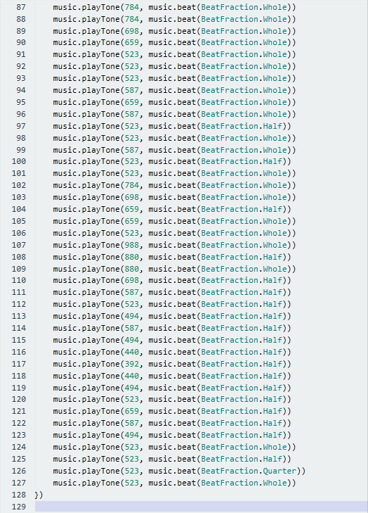

1.  **Test Result：**

Download code to micro:bit board and dial POWER switch to ON end. The“Ode to
Joy” is played by passive buzzer

([How to download?](#A01) [How to quick download?](#_7.3.快速下载))

### 14: RGB Experiments

1.  **Description：**

The RGB color mode is a color standard in the industry. It obtains various
colors by changing the three color channels of red (R), green (G), and blue (B)
and integrating them. RGB denotes the three colors of red, green and blue.  
The monitors mostly adopt the RGB color standard, and all the colors on the
computer screen are composed of the three colors of red, green and blue mixed in
different proportions. A group of red, green and blue is the smallest display
unit. Any color on the screen can be recorded and expressed by a set of RGB
values.

Each of the three color channels of red, green, and blue is divided into 256
levels of brightness. At 0, the "light" is the weakest-it is turned off, and at
255, the "light" is the brightest. When the three-color gray values are the
same, the gray tones with different gray values are produced, that is, when the
three-color gray is 0, the darkest black is generated; when the three-color gray
is 255, it is the brightest white tone .

| Color                                     | RGB value（R,G,B） | Color code | Color    | RGB value（R,G,B） | Color code |
|-------------------------------------------|--------------------|------------|----------|--------------------|------------|
| Black                                     | 0,0,0              | \#000000   | Red      | 255,0,0            | \#FF0000   |
| Green                                     | 0,255,0            | \#00FF00   | Blue     | 0,0,255            | \#0000FF   |
| indigo                                    | 0,255,255          | \#00FFFF   | Dark red | 255,0,255          | \#FF00FF   |
| Yellow                                    | 255,255,0          | \#FFFF00   | White    | 255,255,255        | \#FFFFFF   |
| ......                                    | .......            | ......     | ......   | ......             | ......     |
| Adjust the numbers to get gradient colors |                    |            |          |                    |            |

RGB colors are called additive colors since the adding of R, G, and B together
(that is, all light reflect back to the eye) produces white color. Additive
colors are used for lighting, television and computer displays. For example,
displays produce color by emitting red, green, and blue rays. Most visible
spectra can be expressed as a mixture of red, green and blue (RGB) light in
different proportions and intensities. If these colors overlap, they produce
cyan, magenta and yellow.

We will make two experiments, one is that two RGB LEDs light up red, green,
blue, indigo, dark red, yellow and white color, another one is that RGB lights
display color in gradient way.

**2. What You Need**

1.  Insert micro:bit board into slot of V2 shield.

2.  Place batteries into battery holder.

3.  Plug smart car in power

4.  Link with computer by USB cable and enter online micro:bit editor

Import Hex profile[**(How to import?)** ](#_7.6.导入代码)**,** or click“New
Project”and drag blocks step by step(add k-bit extension library first) [**(How
to add k-bit extension?)**](#M11)

**3. Test Code：**

**Code 1**

RGB emits seven colors

Import hex file

| File Type | Route                                         | File Name           |
|-----------|-----------------------------------------------|---------------------|
| Hex file  | ../Makecode Code/6.14：RGB experiments/Code-1 | microbit-Code-1.hex |

Or you could edit code step by step in the editing area.

1.  Enter“K-Bit”→“LED brightness 0”

Put it into“on start”block.

Change 0 into any number in the range of 0-255, the larger the number set, the
lighter RGB. We set to 70

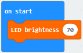

1.  Go to“K-Bit”to move out“set RGB led R：0 G：0 B：0”block into“forever”

Set code as follows:

\*\*\*\*\*\*\*\*\*\*\*\*\*\*\*\*\*\*\*\*\*\*\*\*\*\*\*\*\*\*\*\*\*\*\*\*\*\*\*\*\*\*\*\*\*\*\*\*\*\*\*\*\*\*\*\*\*\*\*\*\*\*\*\*\*\*\*\*\*\*\*\*\*\*\*\*\*

(3) Go to“Basic”to drag block“pause (ms) 100”into“forever”, then set to 1000ms.

(4) Copy code stringfor six times
and put them into“forever”.

\*\*\*\*\*\*\*\*\*\*\*\*\*\*\*\*\*\*\*\*\*\*\*\*\*\*\*\*\*\*\*\*\*\*\*\*\*\*\*\*\*\*\*\*\*\*\*\*\*\*\*\*\*\*\*\*\*\*\*\*\*\*\*\*\*\*\*\*\*\*\*\*\*\*\*\*\*

(5) Separately set to“R：0 G：255 B：0”,“ R：0 G：0 B：255”,“ R：0 G：255
B：255”,“ R：255 G：0 B：255”,“ R：255 G：255 B：0”and“ R：255 G：0 B：255”.

Complete Program：

Click“JavaScript" to view the corresponding JavaScript code:

**Color 2：**

RGB lights display color in gradient way.

| File Type | Route                                          | File Name           |
|-----------|------------------------------------------------|---------------------|
| Hex file  | ../Makecode Code /6.14：RGB experiments/Code-2 | microbit-Code-2.hex |

1.  Go to“K-Bit”to move block“LED brightness 0”into“on start”

Change 0 into 200

1.  Go to“Variables” →“Make a Variable...”→“New variable name：” dialog box，

2.  Input“led-r”and click“OK”to produce variable“led-r”，

Then set variable“led-g”and“led-b”in same way.

Move block“set led-b to 0”into“on start”

Copy“set led-b to 0”block twice and set to led-r, led_g and led_b

\*\*\*\*\*\*\*\*\*\*\*\*\*\*\*\*\*\*\*\*\*\*\*\*\*\*\*\*\*\*\*\*\*\*\*\*\*\*\*\*\*\*\*\*\*\*\*\*\*\*\*\*\*\*\*\*\*\*\*\*\*\*\*\*\*\*\*\*\*\*\*\*\*\*\*\*\*

1.  Go to“Loops”to drag block“repeat 4 times do”into“forever”

(5) Drag block“set RGBled R：0 G：0 B：0” into block“repeat 4 times do”

Click“Variables”to move block“led-r”into 0 box behind R.

1.  Move block“pause (ms) 100”from“Basic”and place it into“repeat 4 times do”.

\*\*\*\*\*\*\*\*\*\*\*\*\*\*\*\*\*\*\*\*\*\*\*\*\*\*\*\*\*\*\*\*\*\*\*\*\*\*\*\*\*\*\*\*\*\*\*\*\*\*\*\*\*\*\*\*\*\*\*\*\*\*\*\*\*\*\*\*\*\*\*\*\*\*\*\*\*

1.  Enter“Variables”to move block“change led-b by 1”under block“pause (ms) 100”.

2.  Click triangle to change led-b into led-r.

The R value is in the range of 0-255, and we make variable“led-r”increases by 5
every time. Therefore, 51 times in total.

Set repeat 51 times and“by 5”.

\*\*\*\*\*\*\*\*\*\*\*\*\*\*\*\*\*\*\*\*\*\*\*\*\*\*\*\*\*\*\*\*\*\*\*\*\*\*\*\*\*\*\*\*\*\*\*\*\*\*\*\*\*\*\*\*\*\*\*\*\*\*\*\*\*\*\*\*\*\*\*\*\*\*\*\*\*

1.  Copy code string once and
    leave it into“forever”.

2.  To make RGB get darker gradually, we set“led-r by -5”, 51 times in total. So
    we change 5 into -5.

    

Replicate twice and keep them
into“forever”block. And edit code string as follows：

Complete Program：

Click“JavaScript" to view the corresponding JavaScript code:

**4. Test Result：**

Download code 1 to micro:bit board and turn on the switch at the back of
micro:bit car, 2 RGB lights of smart car emit red, green, blue, indigo, dark
red, yellow and white color cyclically.

Download code 2 to micro:bit board and turn on the switch at the back of
micro:bit car, 2 RGB lights show different color cyclically.

([How to download?](#A01) [How to quick download?](#_7.3.快速下载))

### 15: Light up KEYES-2812-18R Module

1.  **Description：**

The KEYES-2812-18R module comes with 18 pcs WS2812 RGB lights which are
compatible with Micro:bit board. In this project, we make this module to perform
different effects via four test code.

**2. What You Need**

1.  Insert micro:bit board into slot of V2 shield.

2.  Place batteries into battery holder.

3.  Plug smart car in power

4.  Link with computer by USB cable and enter online micro:bit editor

5.  Import Hex profile[**(How to import?)** ](#_7.6.导入代码)

6.  Or click“New Project”and drag blocks step by step(add k-bit extension
    library first)

[**(How to add k-bit extension?)**](#M11)

**3. Test Code：**

**Code 1：**

**Import hex file**

| File Type | Route                                                        | File Name            |
|-----------|--------------------------------------------------------------|----------------------|
| Hex file  | ../Makecode Code/6.15：Light up KEYES-2812-18R Module/Code-1 |  microbit-Code-1.hex |

Or you could edit code step by step in the editing area.

1.  a. Enter“Neopixel” →“set strip to Neopixel at pin P0 with 24 leds as RGB
    (GRB format)”

b. Place it into“on start”block，

c. Signal end D1 of KEYES-2812-18R module is connected to D5(P5 of micro:bit
board) of expansion . So we set to P5.

d. KEYES-2812-18R module comes with 18 pcs WS2812 RGB, then change 24 into 18.

1.  Click“Neopixel”to move block“strip clear”into“on start”block.

    

\*\*\*\*\*\*\*\*\*\*\*\*\*\*\*\*\*\*\*\*\*\*\*\*\*\*\*\*\*\*\*\*\*\*\*\*\*\*\*\*\*\*\*\*\*\*\*\*\*\*\*\*\*\*\*\*\*\*\*\*\*\*\*\*\*\*\*\*\*\*\*\*\*\*\*\*\*

1.  Enter“Neopixel”to move block “strip show color red” into “forever” block

    

1.  Click“Basic”to move“pause (ms) 100”block into“forever”block

    Then set to 1000ms

    

\*\*\*\*\*\*\*\*\*\*\*\*\*\*\*\*\*\*\*\*\*\*\*\*\*\*\*\*\*\*\*\*\*\*\*\*\*\*\*\*\*\*\*\*\*\*\*\*\*\*\*\*\*\*\*\*\*\*\*\*\*\*\*\*\*\*\*\*\*\*\*\*\*\*\*\*\*

1.  Copy code string for eight
    times, and separately place into“forever”block .

1.  Click triangle button to set orange, yellow, green, blue, indigo, violet
    purple and white.

Complete Program：

Click“JavaScript" to view the corresponding JavaScript code:

**Code 2：**

Hex File:

| File Type | Route                                                        | File Name            |
|-----------|--------------------------------------------------------------|----------------------|
| Hex file  | ../Makecode Code/6.15：Light up KEYES-2812-18R Module/Code-2 |  microbit-Code-2.hex |

1.  a. Enter“Neopixel” →“set strip to Neopixel at pin P0 with 24 leds as RGB
    (GRB format)”

b. Place it into“on start”block，

c. Signal end D1 of KEYES-2812-18R module is connected to D5(P5 of micro:bit
board) of expansion . So we set to P5.

d. KEYES-2812-18R module comes with 18 pcs WS2812 RGB, then change 24 into 18.

1.  Enter“Neopixel”→“strip show rainbow from 1 to 360”

Place it into“on start”

\*\*\*\*\*\*\*\*\*\*\*\*\*\*\*\*\*\*\*\*\*\*\*\*\*\*\*\*\*\*\*\*\*\*\*\*\*\*\*\*\*\*\*\*\*\*\*\*\*\*\*\*\*\*\*\*\*\*\*\*\*\*\*\*\*\*\*\*\*\*\*\*\*\*\*\*\*

1.  Go to“Neopixel”to move“strip shift pixels by 1”into“forever”block.

    

Put block“pause (ms) 100”into“forever”block.

Click“Neopixel”to drag“strip show”into“forever”block.

Complete Program：

Click“JavaScript" to view the corresponding JavaScript code:

**Code 3：**

Hex File:

| File Type | Route                                                        | File Name           |
|-----------|--------------------------------------------------------------|---------------------|
| Hex file  | ../Makecode Code/6.15：Light up KEYES-2812-18R Module/Code-3 | microbit-Code-3.hex |

1.  a. Enter“Neopixel” →“set strip to Neopixel at pin P0 with 24 leds as RGB
    (GRB format)”

b. Place it into“on start”block，

c. Signal end D1 of KEYES-2812-18R module is connected to D5(P5 of micro:bit
board) of expansion . So we set to P5.

d. KEYES-2812-18R module comes with 18 pcs WS2812 RGB, then change 24 into 18.

1.  Click“Loops”to move block“for index from 0 to 4...do”into“forever” block.

Change 4 into 17.

1.  Click“Neopixel”→“strip clear”

Place it into“for index from 0 to 17...do”

\*\*\*\*\*\*\*\*\*\*\*\*\*\*\*\*\*\*\*\*\*\*\*\*\*\*\*\*\*\*\*\*\*\*\*\*\*\*\*\*\*\*\*\*\*\*\*\*\*\*\*\*\*\*\*\*\*\*\*\*\*\*\*\*\*\*\*\*\*\*\*\*\*\*\*\*\*

1.  Drag block“strip set pixel color at 0 to red”from“Neopixel”and place it
    into“forever”block.

Drag variable“index”into 0 box

1.  Enter“Neopixel”to move block“strip show”into“for index from 0 to
    17...do”block.

    

(6) Move block“pause (ms) 100”below block “strip show”

(7) Replicate code stringfor
eight times.

(8) Place it into“forever”block.

Respectively set to orange, yellow, green, blue, indigo, violet, purple and
white.

Complete Program：

Click“JavaScript" to view the corresponding JavaScript code:

**Code 4：**

Import hex file.

Hex File:

| File Type | Route                                                        | File Name           |
|-----------|--------------------------------------------------------------|---------------------|
| Hex file  | ../Makecode Code/6.15：Light up KEYES-2812-18R Module/Code-4 | microbit-Code-4.hex |

1.  a. Enter“Neopixel” →“set strip to Neopixel at pin P0 with 24 leds as RGB
    (GRB format)”

b. Place it into“on start”block，

c. Signal end D1 of KEYES-2812-18R module is connected to D5(P5 of micro:bit
board) of expansion. So we set to P5.

d. KEYES-2812-18R module comes with 18 pcs WS2812 RGB, then change 24 into 18.

\*\*\*\*\*\*\*\*\*\*\*\*\*\*\*\*\*\*\*\*\*\*\*\*\*\*\*\*\*\*\*\*\*\*\*\*\*\*\*\*\*\*\*\*\*\*\*\*\*\*\*\*\*\*\*\*\*\*\*\*\*\*\*\*\*\*\*\*\*\*\*\*\*\*\*\*\*

1.  Go to“Variables” →“Make a Variable...”→ “New variable name：” dialog box，

Input“R”and click “OK” to produce variable“R”，

Then set variable“G”and“B”in same way.

Move block“set B to 0”into“on start”

Copy“set B to 0”block twice and set to R, G and B

1.  Move out“for index from 0 to 4...do”block from“Loops”

Change 4 into 17.

\*\*\*\*\*\*\*\*\*\*\*\*\*\*\*\*\*\*\*\*\*\*\*\*\*\*\*\*\*\*\*\*\*\*\*\*\*\*\*\*\*\*\*\*\*\*\*\*\*\*\*\*\*\*\*\*\*\*\*\*\*\*\*\*\*\*\*\*\*\*\*\*\*\*\*\*\*

1.  Drag block“set B to 0”into“for index from 0 to 4...do”block

Click triangle button to set R.

Go to“Math”block to move out block“pick random 0 to 10”

Set to“pick random 10 to 255”and leave it into 0 box.

1.  Copy codetwice and keep them
    into“for index from 0 to 4...do”block.

Then click triangle button to choose G and B.

1.  Enter“Neopixel”to move block“strip clear”

Leave it under block“Set B...255”block.

\*\*\*\*\*\*\*\*\*\*\*\*\*\*\*\*\*\*\*\*\*\*\*\*\*\*\*\*\*\*\*\*\*\*\*\*\*\*\*\*\*\*\*\*\*\*\*\*\*\*\*\*\*\*\*\*\*\*\*\*\*\*\*\*\*\*\*\*\*\*\*\*\*\*\*\*\*

1.  Click“Neopixel”→“more”→“strip set pixel color at 0 to red”

Put it below the block“strip clear”

Then drag out block“red 255 green 255 blue 255”and place it into red box.

Go to“Variables”to move out“index”,“R”, G”and“B”

Edit the whole code as follows:

(8) Place block“pause (ms) 100”into“for index from 0 to 17...do”

Set to 500ms.

\*\*\*\*\*\*\*\*\*\*\*\*\*\*\*\*\*\*\*\*\*\*\*\*\*\*\*\*\*\*\*\*\*\*\*\*\*\*\*\*\*\*\*\*\*\*\*\*\*\*\*\*\*\*\*\*\*\*\*\*\*\*\*\*\*\*\*\*\*\*\*\*\*\*\*\*\*

(9) Click“Neopixel”to move block“strip show”under block“pause (ms) 500”.

Complete Program：

Click“JavaScript" to view the corresponding JavaScript code:

1.  **Test Results：**

Download code 1 to micro：bit, KEYES-2812-18R module lights up red, orange,
yellow, green, blue, indigo, violet, purple and white color cyclically.

Download code 2 to micro：bit, KEYES-2812-18R module shows rainbow color and
every WS2812RGB light turns off one by one

Download code 3 to micro：bit, every WS2812RGB light shows same color (red,
orange, yellow, green, blue, indigo, violet, purple and white color) and tuns
off one by one.

Download code 4 to micro：bit, every WS2812RGB light shows random color one by
one.

(Note: turn on the switch at the back of micro:bit car)

([How to download?](#A01) [How to quick download?](#_7.3.快速下载))

### 16: Photoresistor

1.  **Description：**

The photocell sensor (photoresistor) is a resistor made by the photoelectric
effect of a semiconductor. It is very sensitive to ambient light, thus its
resistance value vary with different light intensity.

We use its features to design a circuit and generate a photoresistor sensor
module. The signal end of the module is connected to the analog port of the
microcontroller. When the light intensity increases, the resistance decreases,
and the voltage of the analog port rises, that is, the analog value of the
microcontroller also goes up. Otherwise, when the light intensity decreases, the
resistance increases, and the voltage of the analog port declines. That is, the
analog value of the microcontroller becomes smaller. Therefore, we can use the
photoresistor sensor module to read the corresponding analog value and sense the
light intensity in the environment.

It is commonly applied to light measurement, control and conversion, light
control circuit as well.

The smart robot car comes with photoresistor. In the experiment, we control 18
RGB lights by photoresistor. The darker the ambient environment, the lighter the
RGB.

**2. What You Need**

1.  Insert micro:bit board into slot of V2 shield.

2.  Place batteries into battery holder.

3.  Plug smart car in power

4.  Link with computer by USB cable and enter online micro:bit editor

5.  Import Hex profile[**(How to import?)** ](#_7.6.导入代码)

6.  Or click“New Project”and drag blocks step by step(add k-bit extension
    library first)

[**(How to add k-bit extension?)**](#M11)

1.  **Test Code：**

**Code 1：**

Photoresistor detects the light intensity.

Import hex file.

| File Type | Route                                       | File Name           |
|-----------|---------------------------------------------|---------------------|
| Hex file  | ../Makecode Code/6.16：Photoresistor/Code-1 | microbit-Code-1.hex |

Or you could edit code step by step in the editing area.

1.  Click“Advanced”→“Serial”→“serial redirect to USB”

Keep it into“on start”block.

1.  Enter“Advanced” →“Serial” →“serial write value “x”=0”

Leave it into“forever”block.

1.  Click“K_Bit”→“photoresistor”

Leave it into 0 box of “=”

Change“x”into“analog signal”

Drag“pause (ms) 100”block into“forever”block

Complete Program：

Click“JavaScript" to view the corresponding JavaScript code:

Download code to micro:bit board, don’t plug off USB cable
click

([How to quick download?](#_7.3.快速下载))

The data of light intensity is shown below:

The above data shows that as the ambient light intensity gets dark, the analog
value reduces gradually, otherwise, the value is getting bigger.

Open CoolTerm, click Options to select SerialPort. Set COM port and 115200 baud
rate(the baud rate of USB serial communication of Micro:bit is 115200 through
the test). Click “OK” and “Connect”.

CoolTerm serial monitor displays the corresponding value.

The weaker the ambient light intensity, the smaller the analog value.

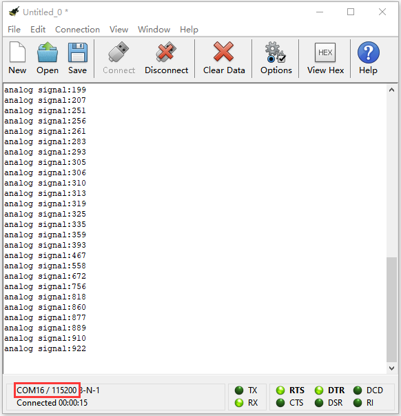

**Code 2：**

Hex File:

| File Type | Route                                                   | File Name           |
|-----------|---------------------------------------------------------|---------------------|
| Hex file  | ../Makecode Code/6.16：Photoresistor Detection-1/Code-2 | microbit-Code-2.hex |

(1)

1.  Click“Variables”→“Make a Variable...”→“New variable name：”dialog box;

2.  Enter“val”and click“OK”to produce variable“val”

3.  Move block“set val to 0”into“on start”block

(2) a. Enter “Neopixel” →“set strip to Neopixel at pin P0 with 24 leds as RGB
(GRB format)”

b. Place it into“on start”block，

c. Signal end D1 of KEYES-2812-18R module is connected to D5(P5 of micro:bit
board) of expansion . So we set to P5.

d. KEYES-2812-18R module comes with 18 pcs WS2812 RGB, then change 24 into 18.

(3) Click“Neopixel”to move block“strip clear”into“on start”block

\*\*\*\*\*\*\*\*\*\*\*\*\*\*\*\*\*\*\*\*\*\*\*\*\*\*\*\*\*\*\*\*\*\*\*\*\*\*\*\*\*\*\*\*\*\*\*\*\*\*\*\*\*\*\*\*\*\*\*\*\*\*\*\*\*\*\*\*\*\*\*\*\*\*\*\*\*

1.  Go to“Variables”to drag block“set strip to 0”into“forever”

Click“strip”to select val.

Go to“Math” to drag “map 0 from low 0 high 1023 to low 0 high 4” block into 0
box.

Then move block“photoresistor”from“K_Bit”block and place it into 0 box behind
map.

Change 4 into 255.

1.  Click“Neopixel”to move“strip show color red”block into“forever”;

Then click“Neopixel” →“more” →“red 255 green 255 blue 255”

Keep it into red box

1.  Go to“Math”to drag“0 - 0” block into“255”box behind red

Enter“Variables”to move variable“val”into 0 box at right and change left 0 into
255\. Then get block“255-val”.

Replicate“255-val”twice and leave them into boxes behind green and blue.

Move block“pause (ms) 100”into“forever”block

Complete Program：

Click“JavaScript" to view the corresponding JavaScript code:

1.  **Test Results：**

Download code 2 to micro:bit board and turn on the switch at the back of
micro:bit car, 18RGB lights emit white color. The darker the light, the stronger
the light intensity of 18 RGB lights

([How to download?](#A01) [How to quick download?](#_7.3.快速下载))

### 17: Motor Driving

1.  **Description：**

Keyestudio Micro：bit robot car is equipped with two DC geared motors.

DC geared motor is integration of reducer and motor, which is widely applied to
steel and machinery industry.

The shield of smart car is inclusive of PCA9685PW and TB6612FNG chip.

In order to save the resources of IO ports, we control the rotation speed and
direction by TB6612FNG chip.

**2. What You Need**

1.  Insert micro:bit board into slot of V2 shield.

2.  Place batteries into battery holder.

3.  Plug smart car in power

4.  Link with computer by USB cable and enter online micro:bit editor.

Import Hex profile [**(How to import?)** ](#_7.6.导入代码), or click“New
Project”and drag blocks step by step(add k-bit extension library first)

[**(How to add k-bit extension?)**](#M11)

**3. Test Code：**

**Code 1：**

Import hex file.

| File Type | Route                                       | File Name           |
|-----------|---------------------------------------------|---------------------|
| Hex file  | ../Makecode Code/6.17：Motor Driving/Code-1 | microbit-Code-1.hex |

Or you could edit code step by step in the editing area.

1.  Click“Led”→“more”→“led enable false”,

Put it into block“on start”，click drop-down triangle button to select“true”
.

\*\*\*\*\*\*\*\*\*\*\*\*\*\*\*\*\*\*\*\*\*\*\*\*\*\*\*\*\*\*\*\*\*\*\*\*\*\*\*\*\*\*\*\*\*\*\*\*\*\*\*\*\*\*\*\*\*\*\*\*\*\*\*\*\*\*\*\*\*\*\*\*\*\*\*\*\*

1.  Click“Basic”→“show arrow North”

Put it into“forever”, and click the triangle button to choose South.

1.  Enter“K_Bit”→“car RunForward speed : 0 %”

Keep it into“forever”, 0 can be replaced by any number in 0-100，we set to 80.

\*\*\*\*\*\*\*\*\*\*\*\*\*\*\*\*\*\*\*\*\*\*\*\*\*\*\*\*\*\*\*\*\*\*\*\*\*\*\*\*\*\*\*\*\*\*\*\*\*\*\*\*\*\*\*\*\*\*\*\*\*\*\*\*\*\*\*\*\*\*\*\*\*\*\*\*\*

1.  Place“pause (ms) 100”below block “car....80%”block.

    

2.  Replicate code stringonce.

Then place it into“forever”，click South to choose North and tap RunForward to
select RunBack.

\*\*\*\*\*\*\*\*\*\*\*\*\*\*\*\*\*\*\*\*\*\*\*\*\*\*\*\*\*\*\*\*\*\*\*\*\*\*\*\*\*\*\*\*\*\*\*\*\*\*\*\*\*\*\*\*\*\*\*\*\*\*\*\*\*\*\*\*\*\*\*\*\*\*\*\*

1.  Replicate“show arrow South”once and place it into“forever”，then click South
    to choose East. 

1.  Enter“K_Bit”→“LeftSide motor run Forward speed : 0 %”

Place it into“forever”and set to 20%.

Duplicate “LeftSide motor run Forward speed : 20 %” again and tap LeftSide to
select RightSide.

Change 20 into 80

Copy “pause (ms) 1000” once and keep it below “Rightside....speed 80%”.

\*\*\*\*\*\*\*\*\*\*\*\*\*\*\*\*\*\*\*\*\*\*\*\*\*\*\*\*\*\*\*\*\*\*\*\*\*\*\*\*\*\*\*\*\*\*\*\*\*\*\*\*\*\*\*\*\*\*\*\*\*\*\*\*\*\*\*\*\*\*\*\*\*\*\*\*\*

1.  Duplicate code string once
    and place it into “forever”，

Set to West , speed 80% and speed 20%.

1.  Copy code stringtwice and
    respectively set to East and West，

Then click RunForward to choose TurnLeft and TurnRight

1.  Enter“Basic”→“show leds”

Leave it under“pause (ms) 1000” block and tick dark blue box to create
reverse“❤”pattern.

1.  Tap“K_Bit”→“car stop”

Move it and“pause (ms) 1000”into“forever”block.

Complete Program：

Click“JavaScript" to view the corresponding JavaScript code:

**Code 2：**

Hex File:

| File Type | Route                                       | File Name           |
|-----------|---------------------------------------------|---------------------|
| Hex file  | ../Makecode Code/6.17：Motor Driving/Code-2 | microbit-Code-2.hex |

1.  Click“Led”→“more”→“led enable false”,

Put it into“on start”block，click drop-down triangle button to select“true”
.

\*\*\*\*\*\*\*\*\*\*\*\*\*\*\*\*\*\*\*\*\*\*\*\*\*\*\*\*\*\*\*\*\*\*\*\*\*\*\*\*\*\*\*\*\*\*\*\*\*\*\*\*\*\*\*\*\*\*\*\*\*\*\*\*\*\*\*\*\*\*\*\*\*\*\*\*\*

1.  Go to“Variables” → “Make a Variable...”→ “New variable name：” dialog box，

Input a and click“OK”to produce variable“a”，

Then create variable“b”in same way

Drag out“set b to 0”block into“on start”and copy it

Click“a”to select“b”

1.  Go to“Input”→“on button A pressed”

Enter“Variables”to place“change b by 1”into“on button A pressed” block.

Click“b”to choose“a”

\*\*\*\*\*\*\*\*\*\*\*\*\*\*\*\*\*\*\*\*\*\*\*\*\*\*\*\*\*\*\*\*\*\*\*\*\*\*\*\*\*\*\*\*\*\*\*\*\*\*\*\*\*\*\*\*\*\*\*\*\*\*\*\*\*\*\*\*\*\*\*\*\*\*\*\*\*

1.  Replicate code string once, click“A”to select“B”

Remove block“change a by 1”

Click“Variables”to drag block“set b to 0”into“on button B pressed”

Then change 0 into 1.

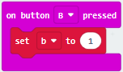

\*\*\*\*\*\*\*\*\*\*\*\*\*\*\*\*\*\*\*\*\*\*\*\*\*\*\*\*\*\*\*\*\*\*\*\*\*\*\*\*\*\*\*\*\*\*\*\*\*\*\*\*\*\*\*\*\*\*\*\*\*\*\*\*\*\*\*\*\*\*\*\*\*\*\*\*\*

1.  Click“logic”→“if true then...”

Place it into“forever”block.

Then move“=”block into true box

Go to“Variables”variable to move variable“a”into left box of“=”

Change 0 into1

\*\*\*\*\*\*\*\*\*\*\*\*\*\*\*\*\*\*\*\*\*\*\*\*\*\*\*\*\*\*\*\*\*\*\*\*\*\*\*\*\*\*\*\*\*\*\*\*\*\*\*\*\*\*\*\*\*\*\*\*\*\*\*\*\*\*\*\*\*\*\*\*\*\*\*\*\*

1.  Click“Basic”to move“show leds”under“if...1 then”block.

    

\*\*\*\*\*\*\*\*\*\*\*\*\*\*\*\*\*\*\*\*\*\*\*\*\*\*\*\*\*\*\*\*\*\*\*\*\*\*\*\*\*\*\*\*\*\*\*\*\*\*\*\*\*\*\*\*\*\*\*\*\*\*\*\*\*\*\*\*\*\*\*\*\*\*\*\*\*

1.  Go to“Logic”→“if true then...”

Leave it under block“show leds”

Copy“a=1”block again and keep it into true box

Enter“Variables”to move variable“b”into left box of “=”block.

\*\*\*\*\*\*\*\*\*\*\*\*\*\*\*\*\*\*\*\*\*\*\*\*\*\*\*\*\*\*\*\*\*\*\*\*\*\*\*\*\*\*\*\*\*\*\*\*\*\*\*\*\*\*\*\*\*\*\*\*\*\*\*\*\*\*\*\*\*\*\*\*\*\*\*\*\*

1.  Then move block“pause (ms) 100”under “if b=1 then” block

Set to 1000ms

Go to“K_Bit”to drag out block“car RunForward speed: 0 %”

Copy“pause (ms) 1000”block again

Then edit the code string as follows:

1.  Replicate code string twice
    and place them under“pause (ms) 1000”block.

Edit the code string as follows:

\*\*\*\*\*\*\*\*\*\*\*\*\*\*\*\*\*\*\*\*\*\*\*\*\*\*\*\*\*\*\*\*\*\*\*\*\*\*\*\*\*\*\*\*\*\*\*\*\*\*\*\*\*\*\*\*\*\*\*\*\*\*\*\*\*\*\*\*\*\*\*\*\*\*\*\*\*

1.  Click“K_Bit”to move“car stop”block under“pause (ms) 1000”block.

Go to“Variables”to drag block“set b to 0”below block“car stop”.

1.  Go to“Logic”to move block“if true then...”into“forever”

Drag block“=”into true box

Duplicate block “a=1”block again

Place it into true box.

\*\*\*\*\*\*\*\*\*\*\*\*\*\*\*\*\*\*\*\*\*\*\*\*\*\*\*\*\*\*\*\*\*\*\*\*\*\*\*\*\*\*\*\*\*\*\*\*\*\*\*\*\*\*\*\*\*\*\*\*\*\*\*\*\*\*\*\*\*\*\*\*\*\*\*\*\*

1.  Copy block“show leds”and tick dark blue boxes to generate“口”pattern.

    

1.  Duplicate“if b=1 then”block once and place it under block“show leds”

\*\*\*\*\*\*\*\*\*\*\*\*\*\*\*\*\*\*\*\*\*\*\*\*\*\*\*\*\*\*\*\*\*\*\*\*\*\*\*\*\*\*\*\*\*\*\*\*\*\*\*\*\*\*\*\*\*\*\*\*\*\*\*\*\*\*\*\*\*\*\*\*\*\*\*\*\*

(14) Copy code stringblock once
and keep it into“if b=1 then”block, and change 620 into 1000, as shown below:

\*\*\*\*\*\*\*\*\*\*\*\*\*\*\*\*\*\*\*\*\*\*\*\*\*\*\*\*\*\*\*\*\*\*\*\*\*\*\*\*\*\*\*\*\*\*\*\*\*\*\*\*\*\*\*\*\*\*\*\*\*\*\*\*\*\*\*\*\*\*\*\*\*\*\*\*\*

(15) Replicatecode string for
five times.

Place the code string into block “if b=1 then” block

Edit and set up the code string as follows

1.  Replicate code string once
    and leave it under block“pause(ms) 620”

1.  Copy “if a=1 then” block once and keep it into“forever”block.

Go to“Variables”to move block“set b to 0”into“if a=1 then”block.

Change b into a, 1 into 3 and 0 into 1.

Complete Program：

Click“JavaScript" to view the corresponding JavaScript code:

**4.Test Result：**

Download code 1 to micro:bit board, car goes forward for 1s, backward for 1s,
turns left for 1s, turns right for 1s, rotates anticlockwise for 1s, clockwise
for 1 and stops for 1s. And dot matrix displays the corresponding patterns

Download code 2 to micro:bit board, “L”will be shown on dot matrix when A button
is pressed, then press B, the route of smart car is “L”type.

“口”will be displayed when the Button A is pressed again, then press B, the
route of smart car is “口”type.

Remember to turn on the switch at the back of micro:bit car.

Note: In order to prevent right tracking sensor from interfering button B, you
need to use screw driver to screw right line tracking sensor clockwise to turn
off it, because the control pins of controlling button B and right line tracking
sensor are P11

([How to download?](#A01) [How to quick download?](#_7.3.快速下载))

### 18: Line Tracking Smart Car

18.1: Detect Line Tracking Sensor

1.  **Description：**

The V2 expansion board of keyestudio Micro：bit mini smart robot car comes with
two line tracking elements which adopt TCRT5000 IR tubes.

TCRT5000 IR tube has an IR emitting tube and a receiving tube.

Low level(0) is output when IR transmitting tube emits IR signals to receiving
tube; high level(1) will be output when smart car runs along black line.

**2. What You Need**

1.  Insert micro:bit board into slot of V2 shield.

2.  Place batteries into battery holder.

3.  Plug smart car in power

4.  Link with computer by USB cable and enter online micro:bit editor.

Import Hex profile [**(How to import?)** ](#_7.6.导入代码), or click“New
Project”and drag blocks step by step(add k-bit extension library first) [**(How
to add k-bit extension?)**](#M11)

**3. Test Code：**

**Code 1：**

Import hex file.

| File Type | Route                                                                                  | File Name            |
|-----------|----------------------------------------------------------------------------------------|----------------------|
| Hex file  | ../Makecode Code/6.18：Line tracking sensor/6.18.1: Detect line tracking Sensor/Code-1 |  microbit-Code-1.hex |

Or you could edit code step by step in the editing area.

1.  Click“Advanced”→“Serial”→“serial redirect to USB”

2.  Place it into“on start”

1.  Enter“Advanced”→“Serial”→“serial write value“x”=0”

2.  Leave it into“forever”block.

3.  Go to“Pins”→“digital read pin P0 ”

4.  Move“digital read pin P0”into 0 box

5.  The right tracking sensor is controlled by P12. Then change P0 into P12
    and“x”into“digital signal”.

1.  Go to“Basic”→“pause (ms) 100”

2.  Keep it into“forever”block and set to 200ms.

Complete Program：

Click“JavaScript"to view the corresponding JavaScript code:

Download code 1 to micro:bit board, don’t plug off USB cable and
click

([How to quick download?](#_7.3.快速下载))

Serial monitor will display low level(0) and D6 indicator will be on when the
right line tracking sensor detects white objects ; when black objects or no
object are detected, 1(high level) will be shown on serial monitor and D6 will
be off, as shown below:

Open CoolTerm, click Options to select SerialPort. Set COM port and 115200 baud
rate(the baud rate of USB serial communication of Micro:bit is 115200 through
the test). Click“OK”and“Connect”.

The CoolTerm serial monitor displays the digital signals read by right line
tracking sensor.

**Code 2：**

Hex File:

| File Type | Route                                                                                     | File Name           |
|-----------|-------------------------------------------------------------------------------------------|---------------------|
| Hex file  | ../Makecode Code/6.18：Line tracking smart car/6.18.1：Detect line tracking sensor/Code-2 | microbit-Code-2.hex |

1.  Click“Led”→“more”→“led enable false”,

Put it into block“on start”，click drop-down triangle button to
select“true”.

\*\*\*\*\*\*\*\*\*\*\*\*\*\*\*\*\*\*\*\*\*\*\*\*\*\*\*\*\*\*\*\*\*\*\*\*\*\*\*\*\*\*\*\*\*\*\*\*\*\*\*\*\*\*\*\*\*\*\*\*\*\*\*\*\*\*\*\*\*\*\*\*\*\*\*\*\*

1.  Go to“Variables” →“Make a Variable...”→ “New variable name：” dialog box.

Enter LL and click“OK”to create variable“LL”.

Next to produce variable“RR”in same way.

Drag block“set RR to 0”into“on start”block and copy it once. Then set code
string:

\*\*\*\*\*\*\*\*\*\*\*\*\*\*\*\*\*\*\*\*\*\*\*\*\*\*\*\*\*\*\*\*\*\*\*\*\*\*\*\*\*\*\*\*\*\*\*\*\*\*\*\*\*\*\*\*\*\*\*\*\*\*\*\*\*\*\*\*\*\*\*\*\*\*\*\*\*

1.  Drag“set RR to 0”into“forever”.

Enter“Advanced”→“Pins”→“digital read pin P0”

Put it into 0 box.

Copy block“set RR to digital read pin P0”once and set to“set LL to digital read
pin P0”.

The left tracking sensor is linked with P13, the right sensor is connected to
P12.

Edit the code string as follows:

\*\*\*\*\*\*\*\*\*\*\*\*\*\*\*\*\*\*\*\*\*\*\*\*\*\*\*\*\*\*\*\*\*\*\*\*\*\*\*\*\*\*\*\*\*\*\*\*\*\*\*\*\*\*\*\*\*\*\*\*\*\*\*\*\*\*\*\*\*\*\*\*\*\*\*\*\*

1.  Enter“Logic”→“if true then...else”

Place it into“forever”and
click“”twice and move“and” block
into“true”box.

\*\*\*\*\*\*\*\*\*\*\*\*\*\*\*\*\*\*\*\*\*\*\*\*\*\*\*\*\*\*\*\*\*\*\*\*\*\*\*\*\*\*\*\*\*\*\*\*\*\*\*\*\*\*\*\*\*\*\*\*\*\*\*\*\*\*\*\*\*\*\*\*\*\*\*\*\*

1.  Go to“Logic”to drag“=”into left box of“and”block.

Click“Variables”to move out variable“LL”into left box of“=”

Replicate“LL=0”once and leave it into right box of“and”block.

Change LL into RR, 0 into 1. As shown below:

1.  Click“Basic”→“show leds”

Put it under“if..LL=0..then”block and tick dark blue boxes to produce“I”pattern

\*\*\*\*\*\*\*\*\*\*\*\*\*\*\*\*\*\*\*\*\*\*\*\*\*\*\*\*\*\*\*\*\*\*\*\*\*\*\*\*\*\*\*\*\*\*\*\*\*\*\*\*\*\*\*\*\*\*\*\*\*\*\*\*\*\*\*\*\*\*\*\*\*\*\*\*\*

1.  Duplicate“LL=0 and RR=1”twice and“show leds”once.

Then edit the code string as follows：

1.  Click“Basic”to place“show icon ❤”under the second“else if..then” block，

Copy it once and click“❤”to select
“” to leave it under else clock.

Complete Program：

If the above the condition is not met, the program under else will be executed LED dot matrix shows“❤”

Click“JavaScript" to view the corresponding JavaScript code:

**Code 3：**

We could use block“”to simplify
code 2. The digital signal read by line tracking sensor is 0(low level) and
1(high level).

Then we transfer the digital signals from line tracking sensor into binary and
decimal system, as shown below:

| Left/Right Line Tracking Sensor（Level） | Binary | Decimal system |   |
|------------------------------------------|--------|----------------|---|
| LOW                                      | HIGH   | 01             | 1 |
| HIGH                                     | LOW    | 10             | 2 |
| HIGH                                     | HIGH   | 11             | 3 |
| LOW                                      | LOW    | 00             | 0 |

Hex File:

| File Type | Route                                                                                     | File Name           |
|-----------|-------------------------------------------------------------------------------------------|---------------------|
| Hex file  | ../Makecode Code/6.18：Line tracking Smart Car/6.18.1：Detect line tracking sensor/Code-3 | microbit-Code-3.hex |

1.  Click“Advanced” →“Serial” →“serial redirect to USB”

Place it into“on start”block.

(2) Click“Variables”→“Make a Variable...”→“New variable name：”dialog box;

Input val and click“OK”to generate variable“val”

Move out“set val to 0”and keep it into block“on start”

\*\*\*\*\*\*\*\*\*\*\*\*\*\*\*\*\*\*\*\*\*\*\*\*\*\*\*\*\*\*\*\*\*\*\*\*\*\*\*\*\*\*\*\*\*\*\*\*\*\*\*\*\*\*\*\*\*\*\*\*\*\*\*\*\*\*\*\*\*\*\*\*\*\*\*\*\*

(3) Enter“Variables” → “set val to 0”

Keep it into “forever” block

Move“Line Tracking”from“K_Bit”and place it into 0 box

\*\*\*\*\*\*\*\*\*\*\*\*\*\*\*\*\*\*\*\*\*\*\*\*\*\*\*\*\*\*\*\*\*\*\*\*\*\*\*\*\*\*\*\*\*\*\*\*\*\*\*\*\*\*\*\*\*\*\*\*\*\*\*\*\*\*\*\*\*\*\*\*\*\*\*\*\*

1.  Click“Advanced”→“Serial”→“serial write value“x”=0”

Put it into“forever”，and move variable “val”into 0 box.

\*\*\*\*\*\*\*\*\*\*\*\*\*\*\*\*\*\*\*\*\*\*\*\*\*\*\*\*\*\*\*\*\*\*\*\*\*\*\*\*\*\*\*\*\*\*\*\*\*\*\*\*\*\*\*\*\*\*\*\*\*\*\*\*\*\*\*\*\*\*\*\*\*\*\*\*\*

1.  Click“Logic”→“if true then...else”

Move it into“forever” , tap“”
twice and move out “=” block into “true” block.

(6) Enter“Variables”to move block“val”into left box of“=”block

And change 0 into 1.

(7) Enter“Basic” → “show leds”

Place it under block“if..val...then”block

Tick dark blue boxes to generate“I”pattern.

(8) Copy block“val=1”twice and separately drag them into boxes behind “else if”.

Then set to“val=2”and“val=3”

Copy“show leds”block once and leave it under the second“else if...then”block.

Tap the dark blue boxes to create“I”pattern, as shown below:

\*\*\*\*\*\*\*\*\*\*\*\*\*\*\*\*\*\*\*\*\*\*\*\*\*\*\*\*\*\*\*\*\*\*\*\*\*\*\*\*\*\*\*\*\*\*\*\*\*\*\*\*\*\*\*\*\*\*\*\*\*\*\*\*\*\*\*\*\*\*\*\*\*\*\*\*\*

(9) Go to“Basic”to move block“show icon ❤”below the second“else if
...then”block.

Replicate“show icon ❤”block and click triangle button to
select“”.

Place it into else block.

Complete Program：

If the above the condition is not met, the program under else will be executed LED dot matrix displays“❤”pattern

Click“JavaScript" to view the corresponding JavaScript code:

**4. Test Result：**

Download code 2 to micro:bit board,“I”will be shown at left and D2 will be on
when only left line tracking sensor detects white objects.

Remember to turn on the switch at the back of micro:bit car.

When only right line tracking sensor detects white objects,“I”will be displayed
at right and D6 will be on.

micro：bit will display“”when
black objects or no objects are detected

If both of them detect white objects, micro：bit will display“❤”pattern and D2
and D6 light up.

([How to download?](#A01) [How to quick download?](#_7.3.快速下载))

Download code 3 to micro:bit board, don’t plug off USB cable and
click

([How to quick download?](#_7.3.快速下载))

Number will be displayed when only left line tracking sensor detects white
objects.

When only right line tracking sensor detects white objects, number 2 will be
shown.

If both of them detect white objects, number 0 will be shown.

Number 3 will be displayed when black objects or no objects are detected

Open CoolTerm, click Options to select SerialPort. Set COM port and 115200 baud
rate(the baud rate of USB serial communication of Micro:bit is 115200 through
the test). Click“OK”and“Connect”，

CoolTerm serial monitor display the value of decimal system.

18.2: Line Tracking Smart Car

1.  **Description：**

In this lesson we will combine line tracking sensors with a motor to make a line
tracking smart car.

The micro:bit board will analyze the signals and control smart car to show line
tracking function.

If two line tracking sensors detect black line, the smart car will go
forward；if only left sensor detects black line, robot car will turn left; if
only right sensor detects black line，smart car will turn right；if black line
is not detected, car will stop.

**2. Preparation：**

1.  Insert micro:bit board into slot of V2 shield.

2.  Place batteries into battery holder.

3.  Plug smart car in power

4.  Link with computer by USB cable and enter online micro:bit editor

5.  Import Hex profile[**(How to import?)** ](#_7.6.导入代码), or click“New
    Project”and drag blocks step by step(add k-bit extension library first)

[**(How to add k-bit extension?)**](#M11)

Warning: the line tracking sensor can't work normally under strong light because
of a mountain of invisible light including IR and ultraviolet rays.

1.  **Flow Chart**

| Left/Right line tracking sensor（Level） |  binary | Decimal system  (a) | Line tracking Smart Car |            |
|------------------------------------------|---------|---------------------|-------------------------|------------|
| LOW                                      | HIGH    | 01                  | 1                       | Turn right |
| HIGH                                     | LOW     | 10                  | 2                       | Turn left  |
| HIGH                                     | HIGH    | 11                  | 3                       | Go forward |
| LOW                                      | LOW     | 00                  | 0                       | STOP       |

1.  **Test Code：**

Import hex file

Hex File:

| File Type | Route                                                            | File Name               |
|-----------|------------------------------------------------------------------|-------------------------|
|  Hex file | ../Makecode Code/6.18：Line tracking Smart Car/6.18.2: Smart Car | microbit- Smart Car.hex |

Or you could edit code step by step in the editing area.

1.  Enter“Basic”→“show icon ♥”

Combine it with“on start” block，and click triangle button to select
“”.

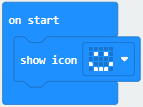

\*\*\*\*\*\*\*\*\*\*\*\*\*\*\*\*\*\*\*\*\*\*\*\*\*\*\*\*\*\*\*\*\*\*\*\*\*\*\*\*\*\*\*\*\*\*\*\*\*\*\*\*\*\*\*\*\*\*\*\*\*\*\*\*\*\*\*\*\*\*\*\*\*\*\*\*\*

1.  Click “Neopixel” →“set strip to Neopixel at pin P0 with 24 leds as RGB (GRB
    format)”

Put it into“on start”block，D1 of KEYES-2812-18R module is connected to D5 which
is P5 of micro:bit board.

Click the triangle button to set to P5.

KEYES-2812-18R module comes with 18pcs RGB lights, as such, change 24 into 18.

1.  Enter“Neopixel”→“strip clear”

Place it into“on start”

\*\*\*\*\*\*\*\*\*\*\*\*\*\*\*\*\*\*\*\*\*\*\*\*\*\*\*\*\*\*\*\*\*\*\*\*\*\*\*\*\*\*\*\*\*\*\*\*\*\*\*\*\*\*\*\*\*\*\*\*\*\*\*\*\*\*\*\*\*\*\*\*\*\*\*\*\*

1.  Enter“Neopixel”→“strip show rainbow from 1 to 360”

Move it into“forever”block.

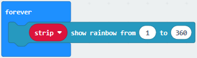

1.  Go to “Variables”→“Make a Variable...”→“New variable name：” dialog box，

Input tracking values and click“OK”to produce variable“tracking values”，

Then drag“set tracking values to 0”from variables

Go to “K_Bit” to move block“Line Tracking”into 0 box

\*\*\*\*\*\*\*\*\*\*\*\*\*\*\*\*\*\*\*\*\*\*\*\*\*\*\*\*\*\*\*\*\*\*\*\*\*\*\*\*\*\*\*\*\*\*\*\*\*\*\*\*\*\*\*\*\*\*\*\*\*\*\*\*\*\*\*\*\*\*\*\*\*\*\*\*\*

1.  Enter“Logic”→“if true then...else”

Place it into“forever”and click“”
twice and move“=” block into “true”box.

1.  Enter “Variables” to drag“tracking values” block into left box of “=”，and
    change 0 into 1

1.  Click“K_Bit”→“LeftSide motor run Forward speed: 0 %”

Place it under“if...tracking values=1 then”block

Alter 0 into 40

Copy block“LeftSide motor run Forward speed: 40 %”once and click triangle
buttons to choose RightSide and Back respectively. As shown below:

1.  Duplicate block“tracking values=1”again.

Leave it into the box of the first“else if ..then”, then change 1 into 2.

\*\*\*\*\*\*\*\*\*\*\*\*\*\*\*\*\*\*\*\*\*\*\*\*\*\*\*\*\*\*\*\*\*\*\*\*\*\*\*\*\*\*\*\*\*\*\*\*\*\*\*\*\*\*\*\*\*\*\*\*\*\*\*\*\*\*\*\*\*\*\*\*\*\*\*\*\*

1.  Replicate code string once.

Leave it under“else if...then”block

Set code string as follows:

\*\*\*\*\*\*\*\*\*\*\*\*\*\*\*\*\*\*\*\*\*\*\*\*\*\*\*\*\*\*\*\*\*\*\*\*\*\*\*\*\*\*\*\*\*\*\*\*\*\*\*\*\*\*\*\*\*\*\*\*\*\*\*\*\*\*\*\*\*\*\*\*\*\*\*\*\*

1.  Replicate code“tracking values=2” again and leave it into the second “else
    if..then”block，and change 2 into 3.

\*\*\*\*\*\*\*\*\*\*\*\*\*\*\*\*\*\*\*\*\*\*\*\*\*\*\*\*\*\*\*\*\*\*\*\*\*\*\*\*\*\*\*\*\*\*\*\*\*\*\*\*\*\*\*\*\*\*\*\*\*\*\*\*\*\*\*\*\*\*\*\*\*\*\*\*\*

1.  Go to“K_Bit”to drag“car RunForward speed: 0 %”under the second “else
    if....then”block.

Alter 0 into 25

\*\*\*\*\*\*\*\*\*\*\*\*\*\*\*\*\*\*\*\*\*\*\*\*\*\*\*\*\*\*\*\*\*\*\*\*\*\*\*\*\*\*\*\*\*\*\*\*\*\*\*\*\*\*\*\*\*\*\*\*\*\*\*\*\*\*\*\*\*\*\*\*\*\*\*\*\*

1.  Go to“K_Bit”to move block“car stop” into else block.

Complete Program：

pattern Set strip to Neopixel at pin P5 with 18leds as RGB(GRB format) Turn off RGB lights on the strip The program under the block“forever”runs cyclically. Strip show rainbow from 1 to 360 Set tracking values to the value of decimal system When tracking values=1, the program under“then”block will be executed The left wheels of car move forward at 40% speed The right wheels of car move backward at 40% speed When tracking values=2, the program under“then”block will be executed The left wheels of car move backward at 40% speed The right wheels of car move forward at 40% speed When tracking values=3, the program under then block will be executed Car goes front at 20% speed When the above value of tracking values is not met, the program under else block will be executed Car stops

Click“JavaScript" to view the corresponding JavaScript code:

**3. Test Result：**

Download code to micro:bit board and line tracking smart car follows the black
line to move.

([How to download?](#A01) [How to quick download?](#_7.3.快速下载))

Note: turn on the switch at the back of micro:bit car.

the width of black tracks should be larger than the distance of two line
tracking sensor.

Avoid to test smart car under the strong light.

### 19: Ultrasonic Follow Smart Car

19.1: Ultrasonic Ranging

**1. Description：**

The HC-SR04 ultrasonic sensor uses sonar to determine distance to an object like
bats do. It offers excellent non-contact range detection with high accuracy and
stable readings in an easy-to-use package. It comes complete with ultrasonic
transmitter and receiver modules.

The HC-SR04 or the ultrasonic sensor is being used in a wide range of
electronics projects for creating obstacle detection and distance measuring
application as well as various other applications.

As the above picture shown, it is like two eyes. One is transmitting end, the
other is receiving end.

The ultrasonic module will emit the ultrasonic waves after trigger signal. When
the ultrasonic waves encounter the object and are reflected back, the module
outputs an echo signal, so it can determine the distance of object from the time
difference between trigger signal and echo signal.

1.  **Working principle ：**

    

2.  Pull down TRIG then trigger high level signals with least 10us

3.  After triggering, the module will automatically send eight 40KHz ultrasonic
    pulses and detect whether there is a signal return.

4.  The propagation speed of sound in the air is about 343m/s; therefore,
    distance = speed \* time, because the ultrasonic wave emits and comes back,
    which is 2 times of distance, so it needs to be divided by 2, the distance
    measured by ultrasonic wave = (speed \* time)/2

**3. Specification：**

-   Working voltage：3-5.5V（DC）

-   Power Supply :+5V DC

-   Working Current: 15mA

-   Working frequency: 40khz

-   Maximum Ranging Distance : around 3m

-   Minimum Ranging Distance: 2-3cm

-   Resolution : 0.3 cm

-   Measuring Angle: ≤15 degree

-   Trigger Input Pulse width: 10uS

-   Accuracy: up to 0.2cm

-   Output echo signal : output TTL level signal(high), which is proportion to
    range.

1.  **Preparation：**

2.  Insert micro:bit board into slot of V2 shield.

3.  Place batteries into battery holder.

4.  Plug smart car in power

5.  Link with computer by USB cable and enter online micro:bit editor

6.  Import Hex profile[**(How to import?)** ](#_7.6.导入代码)**,** or click“New
    Project”and drag blocks step by step(add k-bit extension library first)

[**(How to add k-bit extension?)**](#M11)

1.  **Test Code：**

Import hex file.

| File Type | Route                                                                         | File Name                        |
|-----------|-------------------------------------------------------------------------------|----------------------------------|
|  Hex file | ../Makecode Code/6.19: Ultrasonic Follow Smart Car/6.19.1: Ultrasonic Ranging |  microbit-Ultrasonic Ranging.hex |

Or you could edit code step by step in the editing area.

1.  Tap“Advanced”→“Serial” →“serial redirect to USB”

Combine it with“on start”block

\*\*\*\*\*\*\*\*\*\*\*\*\*\*\*\*\*\*\*\*\*\*\*\*\*\*\*\*\*\*\*\*\*\*\*\*\*\*\*\*\*\*\*\*\*\*\*\*\*\*\*\*\*\*\*\*\*\*\*\*\*\*\*\*\*\*\*\*\*\*\*\*\*\*\*\*\*

1.  Go to “Variables”→“Make a Variable...”→“New variable name：” dialog box，

Input i and click“OK”to produce variable“i”，

Move“set i to 0”from“Variables”and integrate with“on start”block

\*\*\*\*\*\*\*\*\*\*\*\*\*\*\*\*\*\*\*\*\*\*\*\*\*\*\*\*\*\*\*\*\*\*\*\*\*\*\*\*\*\*\*\*\*\*\*\*\*\*\*\*\*\*\*\*\*\*\*\*\*\*\*\*\*\*\*\*\*\*\*\*\*\*\*\*\*

1.  Copy“set i to 0”and keep it into“forever”

Enter“Advanced”→“Serial”→“serial write value x=0”

Leave it into“forever”，

Tap“K_Bit”to move“Ultrasonic”into 0 box.

Change“x”into distance.

\*\*\*\*\*\*\*\*\*\*\*\*\*\*\*\*\*\*\*\*\*\*\*\*\*\*\*\*\*\*\*\*\*\*\*\*\*\*\*\*\*\*\*\*\*\*\*\*\*\*\*\*\*\*\*\*\*\*\*\*\*\*\*\*\*\*\*\*\*\*\*\*\*\*\*\*\*

1.  Enter“Logic”to find out block“if true then”

Place it into“forever”block，then move out block“=” into true box.

1.  Replicate“Ultrasonic”again and leave it into left box of“=”，

Change“=”into“\<”，and“0”into“10”.

\*\*\*\*\*\*\*\*\*\*\*\*\*\*\*\*\*\*\*\*\*\*\*\*\*\*\*\*\*\*\*\*\*\*\*\*\*\*\*\*\*\*\*\*\*\*\*\*\*\*\*\*\*\*\*\*\*\*\*\*\*\*\*\*\*\*\*\*\*\*\*\*\*\*\*\*\*

1.  Go to“Loops”→“while true do”

Leave it under“if ultrasonic...then”block.

Then copy“=”block and leave it into true box.
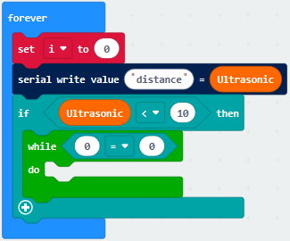

\*\*\*\*\*\*\*\*\*\*\*\*\*\*\*\*\*\*\*\*\*\*\*\*\*\*\*\*\*\*\*\*\*\*\*\*\*\*\*\*\*\*\*\*\*\*\*\*\*\*\*\*\*\*\*\*\*\*\*\*\*\*\*\*\*\*\*\*\*\*\*\*\*\*\*\*\*

1.  Move“Variables”to drag variable“i”into left box of“=”，

Click“=”to select“\<”，and change 0 into 1

\*\*\*\*\*\*\*\*\*\*\*\*\*\*\*\*\*\*\*\*\*\*\*\*\*\*\*\*\*\*\*\*\*\*\*\*\*\*\*\*\*\*\*\*\*\*\*\*\*\*\*\*\*\*\*\*\*\*\*\*\*\*\*\*\*\*\*\*\*\*\*\*\*\*\*\*\*

1.  Go to“Music”to move block “play tone Middle C for 1 beat” into do block，

Move out“pause(ms)100”to choose 200.

\*\*\*\*\*\*\*\*\*\*\*\*\*\*\*\*\*\*\*\*\*\*\*\*\*\*\*\*\*\*\*\*\*\*\*\*\*\*\*\*\*\*\*\*\*\*\*\*\*\*\*\*\*\*\*\*\*\*\*\*\*\*\*\*\*\*\*\*\*\*\*\*\*\*\*\*\*

1.  Replicate code stringonce and
    keep it into “do” block

1.  Move“change i by 1”from“Variables”and place it under “pause(ms) 200”
    

Complete Program：

Click“JavaScript" to view the corresponding JavaScript code:

1.  **Test Result：**

Download code to micro:bit board, don’t plug off USB cable

Turn on the switch at the back of micro:bit car

Click

([How to quick download?](#_7.3.快速下载))

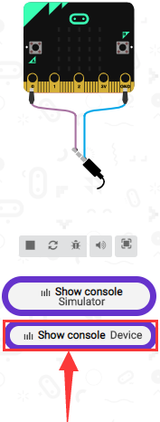

The monitor shows the distance between the obstacle and ultrasonic sensor(as
shown below). When the distance is less than 10cm, the passive buzzer of smart
car emits sound.

Open CoolTerm, click Options to select SerialPort. Set COM port and 115200 baud
rate(the baud rate of USB serial communication of Micro:bit is 115200 through
the test). Click“OK”and“Connect”.

CoolTerm serial monitor displays the distance value as follows:

19.2: Ultrasonic Follow Smart Car

**1. Description：**

In previous lesson, we’ve learned the basic principle of line tracking sensor.
Next, we will combine ultrasonic sensor with car shield to make an ultrasonic
follow car.

**2. Preparation：**

1.  Insert micro:bit board into slot of V2 shield.

2.  Place batteries into battery holder.

3.  Plug smart car in power

4.  Link with computer by USB cable and enter online micro:bit editor

5.  Import Hex profile [**(How to import?)** ](#_7.6.导入代码), or click“New
    Project”and drag blocks step by step(add k-bit extension library first)

[**(How to add k-bit extension?)**](#M11)

**3. Flow Chart：**

1.  **Test Code：**

Import hex file.

| File Type | Route                                                                                  | File Name                                |
|-----------|----------------------------------------------------------------------------------------|------------------------------------------|
|  Hex file | ../Makecode Code/6.19：Ultrasonic Follow Smart Car/6.19.2：Ultrasonic Follow Smart Car | microbit-Ultrasonic Follow Smart Car.hex |

Or you could edit code step by step in the editing area.

1.  Enter“Basic” →“show icon ♥”

Place it into“on start”and click the triangle button to
select“” pattern.

\*\*\*\*\*\*\*\*\*\*\*\*\*\*\*\*\*\*\*\*\*\*\*\*\*\*\*\*\*\*\*\*\*\*\*\*\*\*\*\*\*\*\*\*\*\*\*\*\*\*\*\*\*\*\*\*\*\*\*\*\*\*\*\*\*\*\*\*\*\*\*\*\*\*\*\*\*

1.  a. Enter “Neopixel” →“set strip to Neopixel at pin P0 with 24 leds as RGB
    (GRB format)”

b. Place it into“on start”block，

c. Signal end D1 of KEYES-2812-18R module is connected to D5(P5 of micro:bit
board) of expansion . So we set to P5.

d. KEYES-2812-18R module comes with 18 pcs WS2812 RGB, then change 24 into 18.

\*\*\*\*\*\*\*\*\*\*\*\*\*\*\*\*\*\*\*\*\*\*\*\*\*\*\*\*\*\*\*\*\*\*\*\*\*\*\*\*\*\*\*\*\*\*\*\*\*\*\*\*\*\*\*\*\*\*\*\*\*\*\*\*\*\*\*\*\*\*\*\*\*\*\*\*\*

1.  Tap“Neopixel”→“strip clear”

Keep it into“on start”block.

1.  Go to“Variables”→“Make a Variable...”→“New variable name：” dialog box，

Input distance and click“OK”to produce variable“distance”，

Drag out“set distance to 0”into“on start”

\*\*\*\*\*\*\*\*\*\*\*\*\*\*\*\*\*\*\*\*\*\*\*\*\*\*\*\*\*\*\*\*\*\*\*\*\*\*\*\*\*\*\*\*\*\*\*\*\*\*\*\*\*\*\*\*\*\*\*\*\*\*\*\*\*\*\*\*\*\*\*\*\*\*\*\*\*

1.  Click“Variables”to move out“set distance to 0”

Keep it below block “strip clear”block.

Click“K_Bit”to drag block“Ultrasonic”into 0 box.

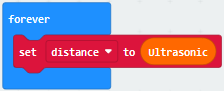

\*\*\*\*\*\*\*\*\*\*\*\*\*\*\*\*\*\*\*\*\*\*\*\*\*\*\*\*\*\*\*\*\*\*\*\*\*\*\*\*\*\*\*\*\*\*\*\*\*\*\*\*\*\*\*\*\*\*\*\*\*\*\*\*\*\*\*\*\*\*\*\*\*\*\*\*\*

1.  Enter“Logic”to move out“if true then”into“forever”,

Then place“and”block into true box.

\*\*\*\*\*\*\*\*\*\*\*\*\*\*\*\*\*\*\*\*\*\*\*\*\*\*\*\*\*\*\*\*\*\*\*\*\*\*\*\*\*\*\*\*\*\*\*\*\*\*\*\*\*\*\*\*\*\*\*\*\*\*\*\*\*\*\*\*\*\*\*\*\*\*\*\*\*

1.  Click“Logic”to move out“=”into left box of and block

Move out variable“distance”into left box of“=”block

Change“=”into“≥”and 0 into 10.

Replicate“distance≥10”once and leave it into right box of“and”block.

Then we set distance ≤30

\*\*\*\*\*\*\*\*\*\*\*\*\*\*\*\*\*\*\*\*\*\*\*\*\*\*\*\*\*\*\*\*\*\*\*\*\*\*\*\*\*\*\*\*\*\*\*\*\*\*\*\*\*\*\*\*\*\*\*\*\*\*\*\*\*\*\*\*\*\*\*\*\*\*\*\*\*

1.  Click“K_Bit”→“car RunForward speed: 0 %”

Leave it under“if...30 then” block. Then change 0 into 40.

Go to“Neopixel” →“strip show color red”

Place it under“car RunForward speed: 40 %”block.

\*\*\*\*\*\*\*\*\*\*\*\*\*\*\*\*\*\*\*\*\*\*\*\*\*\*\*\*\*\*\*\*\*\*\*\*\*\*\*\*\*\*\*\*\*\*\*\*\*\*\*\*\*\*\*\*\*\*\*\*\*\*\*\*\*\*\*\*\*\*\*\*\*\*\*\*\*

1.  Duplicate code string once
    and keep it into “forever”，

Delete block“distance≥10”and“and”block，

Change 30 into 6, RunForward into RunBack and red into yellow.

1.  Copy code string once and
    place it into“forever”，

Delete block“distance≤6”and“car RunBack speed: 40 %”

Go to“Logic”to drag out block“or”into true box，

Move block“and”into left box of“or”block，

Replicate block“distance≤6”once and place it into left box of“and”block，

Change“≤”into“\>”，and duplicate block “distance≥10”once and move into right box
of“and”，

Change“≥”into“\<”，and copy block“distance≤30”once and drag into right box
of“or”，

Change“≤”into“\>”，and move block“car stop”from“K_Bit”

Keep“car stop”block under“if...then”block

Alter yellow into white.

Complete Program：

”图案。

.③将strip设为引脚P5初始化灯带18颗LED（模式RGB（GRB顺序））

.④Turn off RGB lights on the strip

.⑤将变量distance设为0

.⑥The program under the block “forever” runs cyclically.

.⑦将变量distance设为超声波传感器读取的距离值。

.⑧当10cm≤distance≤30cm成立时，执行then →程序

.⑨小车以40%速度前进

.⑩strip上18个RGB都亮红色灯

.⑪当distance≤6cm成立时，执行then →程序

.⑫小车以40%速度后退

.⑬strip上18个RGB都亮黄色灯

.⑭当6cm\<distance\<10cm或distance\>30cm成立时，执行then →程序

.⑮小车停止

.⑯strip上18个RGB都亮白色灯

.①“on start”: command block runs once to start program.

.②LED dot matrix显示“”图案。

.③将strip设为引脚P5初始化灯带18颗LED（模式RGB（GRB顺序））

.④Turn off RGB lights on the strip

.⑤将变量distance设为0

.⑥The program under the block “forever” runs cyclically.

.⑦将变量distance设为超声波传感器读取的距离值。

.⑧当10cm≤distance≤30cm成立时，执行then →程序

.⑨小车以40%速度前进

.⑩strip上18个RGB都亮红色灯

.⑪当distance≤6cm成立时，执行then →程序

.⑫小车以40%速度后退

.⑬strip上18个RGB都亮黄色灯

.⑭当6cm\<distance\<10cm或distance\>30cm成立时，执行then →程序

.⑮小车停止

.⑯strip上18个RGB都亮白色灯

Click“JavaScript" to view the corresponding JavaScript code:

**4. Test Result：**

Download code on micro:bit board, and turn on the switch at the back of
micro:bit car.

The smart car follows the obstacle to move. And 18 pcs RGB lights emit different
color.

([How to download?](#A01) [How to quick download?](#_7.3.快速下载))

### 20: Obstacle Avoidance and Follow Smart Car

20.1: Obstacle Avoidance Function

**1. Description：**

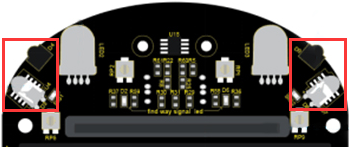

The shield of smart car comes with two IR obstacle avoidance sensors which adopt
transmitting tube and receiving tube.

The IR rays will reflect back to receiving tube if there is an obstacle. Next,
sensor will determine the obstacle and send test result to microcontroller.

After a series of processing analysis, the smart car will avoid the obstacle.

The low level (0) will be output when the obstacle is detected, otherwise, the
high level(1) will be output

IR obstacle avoidance sensor is generally applied to obstacle avoiding, line
tracking, anti-falling, counter and production line cutting and liquid level
detection, etc

**2. What You Need**

1.  Insert micro:bit board into slot of V2 shield.

2.  Place batteries into battery holder.

3.  Plug smart car in power

4.  Link with computer by USB cable and enter online micro:bit editor

5.  Import Hex profile[**(How to import?)** ](#_7.6.导入代码)**,** or click“New
    Project”and drag blocks step by step(add k-bit extension library first)

[**(How to add k-bit extension?)**](#M11)

**3. Test Code：**

**Code 1：**

Import hex file

| File Type | Route                                                                                                      | File Name            |
|-----------|------------------------------------------------------------------------------------------------------------|----------------------|
|  Hex file | ../Makecode Code/6.20：Obstacle Avoidance and Follow Smart Car/6.20.1：Obstacle Avoidance Function /Code-1 |  microbit-Code-1.hex |

Or you could edit code step by step in the editing area.

1.  Click“Advanced”→“Serial”→“serial redirect to USB”

Keep it into“on start”block

1.  Enter“Advanced”→“Serial”→“serial write value“x”=0”

Place it into“forever”block

1.  Go to“K_Bit”→“LeftSide obstacle sensor”

Move it into 0 box and change“x”into“digital signal”.

1.  Go to“Basic”→“pause (ms) 100”,

Place it into“forever”，and set to 200ms

Complete Program：

Click“JavaScript" to view the corresponding JavaScript code:

Download code on the micro:bit board, and don’t plug off USB cable.

Click the button

([How to quick download?](#_7.3.快速下载) )

The digital signals detected by left IR obstacle avoidance sensor. When it
detects the obstacle, the signal end outputs low level(0) and SIG1 lights on;
when no obstacle is detected, the signal end outputs high level(1).

Open CoolTerm, click Options to select SerialPort. Set COM port and 115200 baud
rate(the baud rate of USB serial communication of Micro:bit is 115200 through
the test). Click“OK”and“Connect”

CoolTerm monitor displays the digital signals detected by left IR obstacle
avoidance sensor, as show below:

**Code 2：**

Hex File:

| File Type | Route                                                                                                 | File Name            |
|-----------|-------------------------------------------------------------------------------------------------------|----------------------|
|  Hex file | ../Projects/6.17：Obstacle Avoidance and Follow Smart Car/6.17.1：Obstacle Avoidance Function /Code-2 |  microbit-Code-2.hex |

1.  Click“Led”→“more”→“led enable false”

Put it in the block“on start”，and click drop-down triangle button to
select“true” .

\*\*\*\*\*\*\*\*\*\*\*\*\*\*\*\*\*\*\*\*\*\*\*\*\*\*\*\*\*\*\*\*\*\*\*\*\*\*\*\*\*\*\*\*\*\*\*\*\*\*\*\*\*\*\*\*\*\*\*\*\*\*\*\*\*\*\*\*\*\*\*\*\*\*\*\*\*

1.  Enter“Logic”→“if true then...else”

Place it into“forever”and click“”
twice and move“and”block into“true”box.

1.  Tap“Logic”to drag block“=”into left box of“and”.

Click“K_Bit”to move“LeftSide obstacle sensor”into left box of “=” block

Then copy“LeftSide obstacle sensor=0”again

And leave it into right box of“and”block

Change LeftSide into RightSide.

\*\*\*\*\*\*\*\*\*\*\*\*\*\*\*\*\*\*\*\*\*\*\*\*\*\*\*\*\*\*\*\*\*\*\*\*\*\*\*\*\*\*\*\*\*\*\*\*\*\*\*\*\*\*\*\*\*\*\*\*\*\*\*\*\*\*\*\*\*\*\*\*\*\*\*\*\*

1.  Tap“Basic”to drag out block“show icon ❤”

Leave it under“if...then”block and click the triangle button to
select“” pattern.

\*\*\*\*\*\*\*\*\*\*\*\*\*\*\*\*\*\*\*\*\*\*\*\*\*\*\*\*\*\*\*\*\*\*\*\*\*\*\*\*\*\*\*\*\*\*\*\*\*\*\*\*\*\*\*\*\*\*\*\*\*\*\*\*\*\*\*\*\*\*\*\*\*\*\*\*\*

1.  Copy block“LeftSide obstacle sensor=0 and RightSide obstacle sensor=0”once
    and place it into“else if....then”block，and set Rightsite obstacle sensor
    =1.

1.  Click“Basic”→“show leds”

Keep it under “else if...then” block and tick dark blue boxes to create “→”
pattern.

1.  Replicate code“LeftSide obstacle sensor=0 and RightSide obstacle
    sensor=0”again.

Set to“LeftSide obstacle sensor=1 and RightSide obstacle sensor=0”

Leave it into the second“else if...then”block.

\*\*\*\*\*\*\*\*\*\*\*\*\*\*\*\*\*\*\*\*\*\*\*\*\*\*\*\*\*\*\*\*\*\*\*\*\*\*\*\*\*\*\*\*\*\*\*\*\*\*\*\*\*\*\*\*\*\*\*\*\*\*\*\*\*\*\*\*\*\*\*\*\*\*\*\*\*

1.  Copy block“show leds”twice and place them under the second block“else
    if...then”and“else”.

Tick dark blue boxes to produce“←”and“↑”pattern.

Complete Program：

When LeftSide obstacle sensor=0 and RightSide obstacle sensor=1，the next program will be activated LED dot matrix displays“→” When LeftSide obstacle sensor=1 and RightSide obstacle sensor=0，the next program will be activated LED dot matrix shows“←” If the above conditions are not met,. the program under else will be activated LED dot matrix shows“↑”

Click“JavaScript" to view the corresponding JavaScript code:

**4. Test Result：**

Download code 2 to micro:bit board and turn on the switch at the back of
micro:bit car.

When only left obstacle avoidance sensor detects the obstacle, the leftward
arrow pattern is shown.

When only right obstacle avoidance sensor detects the obstacle, the rightward
arrow pattern is displayed.

When both of them detect the obstacle, the smile face pattern appears, however,
none of them detects the obstacle, the upward arrow is shown.

([How to download?](#A01) [How to quick download?](#_7.3.快速下载))

20.2: Obstacle Avoidance Smart Car

1.  **Description：**

We’ve learned the knowledge of obstacle avoidance sensor. In this project, we
will integrate ultrasonic sensor, IR obstacle avoidance sensor and car expansion
board to make an obstacle avoidance smart car.

Its principle is to detect the distance between the car and obstacle by
ultrasonic sensor and IR obstacle avoidance sensors and control the motion of
smart car.

Left obstacle avoidance sensor is controlled by P2 and right one is decided by
P11

1.  **Preparation：**

2.  Insert micro:bit board into slot of V2 shield.

3.  Place batteries into battery holder.

4.  Plug smart car in power

5.  Link with computer by USB cable and enter online micro:bit editor

6.  Import Hex profile [**(How to import?)** ](#_7.6.导入代码)**,** or click“New
    Project”and drag blocks step by step(add k-bit extension library first)

[**(How to add k-bit extension?)**](#M11)

Warning: the obstacle avoidance sensor can't work normally under strong light
because there is a mountain of invisible light including IR and ultraviolet
rays.

3\. Flow Chart

**4. Test Code：**

Import hex file.

| File Type | Route                                                                                               | File Name                                 |
|-----------|-----------------------------------------------------------------------------------------------------|-------------------------------------------|
| Hex file  | ../Makecode Code/6.20：Obstacle Avoidance and Follow Smart Car/6.20.2：Obstacle Avoidance Smart Car | microbit-Obstacle Avoidance Smart Car.hex |

Or you could edit code step by step in the editing area.

1.  a. Enter“Neopixel” →“set strip to Neopixel at pin P0 with 24 leds as RGB
    (GRB format)”

b. Place it into“on start”block，

c. Signal end D1 of KEYES-2812-18R module is connected to D5(P5 of micro:bit
board) of expansion . So we set to P5.

d. KEYES-2812-18R module comes with 18 pcs WS2812 RGB, then change 24 into 18.

1.  Go to“Variables”→“Make a Variable...”→“New variable name：” dialog box，

2.  Input“distance”and click“OK”to produce variable“distance”.

Move“set distance to 0”and edit this code as follows:

\*\*\*\*\*\*\*\*\*\*\*\*\*\*\*\*\*\*\*\*\*\*\*\*\*\*\*\*\*\*\*\*\*\*\*\*\*\*\*\*\*\*\*\*\*\*\*\*\*\*\*\*\*\*\*\*\*\*\*\*\*\*\*\*\*\*\*\*\*\*\*\*\*\*\*\*\*

1.  Then we generate variable“val_L”and“val_R”in same way.

Drag out“set val_R to 0”block and copy it twice

Separately set to distance, val_L and val_R and place them into“forever” block.

Go to“K_Bit”to move out“Ultrasonic”and“LeftSide obstacle sensor”

Copy “LeftSide obstacle sensor”once and place them into code string as follows:

1.  Enter“Logic”→“if true then...else”

Place it into“forever”and
click“”for four times and
move“and” block into“true”box.

1.  Click“Logic”and drag“=”block into left box of“and”block

Go to“Variables”to move“val_L” into left box of“=”block and copy

“val_L=0”block once.

Click triangle button to select val_R

Place“val_R=0”into right box of and block.

\*\*\*\*\*\*\*\*\*\*\*\*\*\*\*\*\*\*\*\*\*\*\*\*\*\*\*\*\*\*\*\*\*\*\*\*\*\*\*\*\*\*\*\*\*\*\*\*\*\*\*\*\*\*\*\*\*\*\*\*\*\*\*\*\*\*\*\*\*\*\*\*\*\*\*\*\*

1.  Enter“K_Bit”→“car RunForward speed：0%”

Set to 40% and click triangle button to select RunBack

Click“Neopixel”→“strip show color red”

And leave it below block“car...40%”block.

Move“pause(ms)100”block under block“strip show color red”block.

Copy block“car Runbank speed:40%”and“pause(ms)100”block

Change Runbank into Turnleft and 40% into 20% and delay in 200ms

Edit code string as follows:

\*\*\*\*\*\*\*\*\*\*\*\*\*\*\*\*\*\*\*\*\*\*\*\*\*\*\*\*\*\*\*\*\*\*\*\*\*\*\*\*\*\*\*\*\*\*\*\*\*\*\*\*\*\*\*\*\*\*\*\*\*\*\*\*\*\*\*\*\*\*\*\*\*\*\*\*\*

1.  Replicate block“val_L=0 and val_R=0”once

Place it into block the first“else if...then”block

\*\*\*\*\*\*\*\*\*\*\*\*\*\*\*\*\*\*\*\*\*\*\*\*\*\*\*\*\*\*\*\*\*\*\*\*\*\*\*\*\*\*\*\*\*\*\*\*\*\*\*\*\*\*\*\*\*\*\*\*\*\*\*\*\*\*\*\*\*\*\*\*\*\*\*\*\*

1.  Replicate block“car TurnLeft speed：20%”and“strip show color red”again.

Change red into purple.

1.  Duplicate block“val_L=0 and val_R=0”once

Place it into the second“else if..then”block.

Copy  code string once and leave
it under the second“else if...then”block.

Change TurnLeft into TurnRight , 0 into 1 and purple into yellow.

\*\*\*\*\*\*\*\*\*\*\*\*\*\*\*\*\*\*\*\*\*\*\*\*\*\*\*\*\*\*\*\*\*\*\*\*\*\*\*\*\*\*\*\*\*\*\*\*\*\*\*\*\*\*\*\*\*\*\*\*\*\*\*\*\*\*\*\*\*\*\*\*\*\*\*\*\*

1.  Click“Logic”to drag“and”block into box behind the third “else if
    ....then”block

Move“=”block into left box of“and”block.

Enter“Variables”to drag variable“distance”into left box of “=”block

Change“=”into“≤”and 0 into 10.

Move“val_L=0 and val_R=0”into right box of “and” block

Then set to“val_L=1 and val_R=1”

1.  Duplicate code string once
    and leave it under the third“else if...then”block.

Change yellow into blue.

\*\*\*\*\*\*\*\*\*\*\*\*\*\*\*\*\*\*\*\*\*\*\*\*\*\*\*\*\*\*\*\*\*\*\*\*\*\*\*\*\*\*\*\*\*\*\*\*\*\*\*\*\*\*\*\*\*\*\*\*\*\*\*\*\*\*\*\*\*\*\*\*\*\*\*\*\*

1.  Duplicate“distance≤10 and val_L=1 and val_R=1”once

Replicate block“distance≤10 and val_L=1 and val_R=1”once and put it into the
fourth“else if...then”block.

Change“≤”into“\>”

1.  Duplicate code string once
    and keep it under the fourth“else if...then”block.

Change TurnRight into RunForward, 20 into 40 and blue into green.

Complete Program：

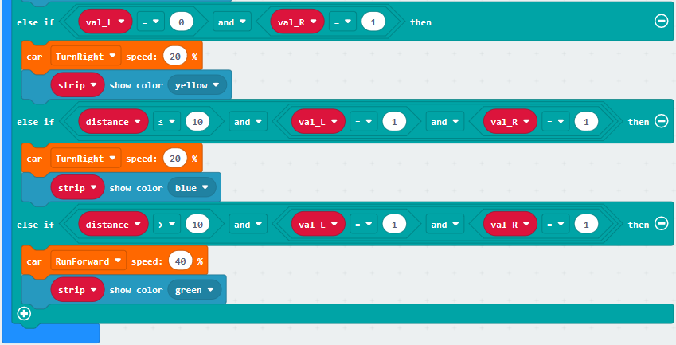

Click“JavaScript" to view the corresponding JavaScript code:

1.  **Test Result：**

Download test code to micro:bit and turn on the switch at the back of micro:bit
car.

The smart car will avoid the obstacle.

([How to download?](#A01) [How to quick download?](#_7.3.快速下载))

6.20.3: Following Smart Car

**1. Description：**

In this chapter, we will integrate ultrasonic sensor, IR obstacle avoidance
sensor and car expansion board to make a multi-directional follow smart car. Its
principle is to detect the distance between the car and obstacle by ultrasonic
sensor and IR obstacle avoidance sensors and control the motion of smart car.

1.  **Preparation：**

(1) Insert micro:bit board into slot of V2 shield.

(2) Place batteries into battery holder.

(3) Plug smart car in power

(4) Link with computer by USB cable and enter online micro:bit editor

(5) Import Hex profile[**(How to import?)** ](#_7.6.导入代码), or click“New
Project”and drag blocks step by step(add k-bit extension library first)

[**(How to add k-bit extension?)**](#M11)

Warning: the obstacle avoidance sensor can't work normally under strong light
because there is a mountain of invisible light including IR and ultraviolet
rays.

1.  **Flow Chart：**

1.  **Test Code：**

Import hex file.

| File Type | Route                                                                                      | File Name                        |
|-----------|--------------------------------------------------------------------------------------------|----------------------------------|
| Hex file  | ../Makecode Code/6.20：Obstacle Avoidance and Follow Smart Car/6.20.3：Following Smart Car | microbit-Following Smart Car.hex |

Or you could edit code step by step in the editing area.

1.  a. Enter“Neopixel”→“set strip to Neopixel at pin P0 with 24 leds as RGB (GRB
    format)”

b. Place it into“on start”block，

c. Signal end D1 of KEYES-2812-18R module is connected to D5(P5 of micro:bit
board) of expansion . So we set to P5.

d. KEYES-2812-18R module comes with 18 pcs WS2812 RGB, then change 24 into 18.

1.  Go to“Variables”→ “Make a Variable...”→“New variable name：” dialog box，

Input“distance”and click“OK”to produce variable“distance”.

Then we generate variable“val_L”and“val_R”in same way.

Drag out“set val_R to 0”block and copy it twice

Separately set to distance, val_L and val_R and place them into“forever” block.

\*\*\*\*\*\*\*\*\*\*\*\*\*\*\*\*\*\*\*\*\*\*\*\*\*\*\*\*\*\*\*\*\*\*\*\*\*\*\*\*\*\*\*\*\*\*\*\*\*\*\*\*\*\*\*\*\*\*\*\*\*\*\*\*\*\*\*\*\*\*\*\*\*\*\*\*\*

1.  Duplicate code string once
    and leave it into“forever”.

Click“K_Bit”to move out“Ultrasonic”and“LeftSide obstacle sensor”

Copy “LeftSide obstacle sensor”again

Leave them into 0 boxes as follows and edit code string.

\*\*\*\*\*\*\*\*\*\*\*\*\*\*\*\*\*\*\*\*\*\*\*\*\*\*\*\*\*\*\*\*\*\*\*\*\*\*\*\*\*\*\*\*\*\*\*\*\*\*\*\*\*\*\*\*\*\*\*\*\*\*\*\*\*\*\*\*\*\*\*\*\*\*\*\*\*

1.  Enter“Logic”→“if true then...else”

Place it into“forever”and
click“”for four times and
move“and” block into“true”box.

Copy“and”block twice and separately leave them into both side of “and”block.

1.  Go to“Logic”to move out“=”block and leave it into left box of “and” block.

Then go to “Variables” to drag out variable“distance”into left box of “=” block

Change“=”into“\>”, 0 into 3; then replicate“distance\>3”block for three times

Place them into boxes and edit code as follows:

\*\*\*\*\*\*\*\*\*\*\*\*\*\*\*\*\*\*\*\*\*\*\*\*\*\*\*\*\*\*\*\*\*\*\*\*\*\*\*\*\*\*\*\*\*\*\*\*\*\*\*\*\*\*\*\*\*\*\*\*\*\*\*\*\*\*\*\*\*\*\*\*\*\*\*\*\*

1.  Move out“car stop”from“K_Bit”

Click “Neopixel”to drag block“strip show color red”into “if....then” block.

\*\*\*\*\*\*\*\*\*\*\*\*\*\*\*\*\*\*\*\*\*\*\*\*\*\*\*\*\*\*\*\*\*\*\*\*\*\*\*\*\*\*\*\*\*\*\*\*\*\*\*\*\*\*\*\*\*\*\*\*\*\*\*\*\*\*\*\*\*\*\*\*\*\*\*\*\*

1.  Enter“Logic”to drag out block“or”into box of“else if....then”block

Copy block“distance≤6”again and keep it into left box of “or”block.

Change 6 into 3

Replicate“val_L=1 and val_R=1”once and leave it into right box of “or”block

Change 1 into 0

\*\*\*\*\*\*\*\*\*\*\*\*\*\*\*\*\*\*\*\*\*\*\*\*\*\*\*\*\*\*\*\*\*\*\*\*\*\*\*\*\*\*\*\*\*\*\*\*\*\*\*\*\*\*\*\*\*\*\*\*\*\*\*\*\*\*\*\*\*\*\*\*\*\*\*\*\*

1.  Go to“K_Bit” to move block“car RunForward speed: 0%” under the first“else
    if....then”block.

Change RunForward into RunBack and 0 into 30

Copy“strip show color red”once and set to purple

\*\*\*\*\*\*\*\*\*\*\*\*\*\*\*\*\*\*\*\*\*\*\*\*\*\*\*\*\*\*\*\*\*\*\*\*\*\*\*\*\*\*\*\*\*\*\*\*\*\*\*\*\*\*\*\*\*\*\*\*\*\*\*\*\*\*\*\*\*\*\*\*\*\*\*\*\*

1.  Copy“distance≤3 or val_L=0 and val_R=0”once and leave it into box of the
    second“else if.....then”

Change“≤”into“\>”, or into and, 3 into 6, and 0 into 1.

1.  Copy code string once and
    leave it into boxes under the second“else if...then”block

Change RunBack into RunForward and purple into blue.

\*\*\*\*\*\*\*\*\*\*\*\*\*\*\*\*\*\*\*\*\*\*\*\*\*\*\*\*\*\*\*\*\*\*\*\*\*\*\*\*\*\*\*\*\*\*\*\*\*\*\*\*\*\*\*\*\*\*\*\*\*\*\*\*\*\*\*\*\*\*\*\*\*\*\*\*\*

1.  Duplicate the block“val_L=1 and val_R=1”once and keep it into box of the
    third “else if ...then”block

Alter left 0 into 1.

\*\*\*\*\*\*\*\*\*\*\*\*\*\*\*\*\*\*\*\*\*\*\*\*\*\*\*\*\*\*\*\*\*\*\*\*\*\*\*\*\*\*\*\*\*\*\*\*\*\*\*\*\*\*\*\*\*\*\*\*\*\*\*\*\*\*\*\*\*\*\*\*\*\*\*\*\*

1.  Copy code string once and
    leave it under the third “else if ....then”block.

Change RunForward into TurnLeft and blue into green.

\*\*\*\*\*\*\*\*\*\*\*\*\*\*\*\*\*\*\*\*\*\*\*\*\*\*\*\*\*\*\*\*\*\*\*\*\*\*\*\*\*\*\*\*\*\*\*\*\*\*\*\*\*\*\*\*\*\*\*\*\*\*\*\*\*\*\*\*\*\*\*\*\*\*\*\*\*

1.  Copy the block“val_L=0 and val_R=1”and place it into box of the fourth“else
    if...then”block

Change left 0 into 1, and right 1 into 0

\*\*\*\*\*\*\*\*\*\*\*\*\*\*\*\*\*\*\*\*\*\*\*\*\*\*\*\*\*\*\*\*\*\*\*\*\*\*\*\*\*\*\*\*\*\*\*\*\*\*\*\*\*\*\*\*\*\*\*\*\*\*\*\*\*\*\*\*\*\*\*\*\*\*\*\*\*

1.  Duplicate code string once
    and leave it under the fourth“else if....then”block.

Alter TurnLeft into TurnRight and green into yellow.

1.  Copy code stringonce and
    place it under“else” block

Complete Program：

Click“JavaScript" to view the corresponding JavaScript code:

1.  **Test Result：**

Download the code to micro:bit board and turn on the switch at the back of
micro:bit car.

Car will follow the obstacle to move.

([How to download?](#A01) [How to quick download?](#_7.3.快速下载))

### 21: IR Remote Control Smart Car

21.1: Decode IR Remote Control

1.  **Description：**

There is no doubt that infrared remote control is ubiquitous in daily life. It
is used to control various household appliances, such as TVs, stereos, video
recorders and satellite signal receivers. Infrared remote control is composed of
infrared transmitting and infrared receiving systems, that is, an infrared
remote control and infrared receiving module and a single-chip microcomputer
capable of decoding.​

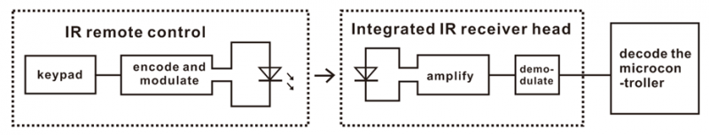

The 38K infrared carrier signal emitted by remote controller is encoded by the
encoding chip in the remote controller. It is composed of a section of pilot
code, user code, user inverse code, data code, and data inverse code. The time
interval of the pulse is used to distinguish whether it is a 0 or 1 signal and
the encoding is made up of these 0, 1 signals.

The user code of the same remote control is unchanged. The data code can
distinguish the key.

When the remote control button is pressed, the remote control sends out an
infrared carrier signal. When the IR receiver receives the signal, the program
will decode the carrier signal and determines which key is pressed. The MCU
decodes the received 01 signal, thereby judging what key is pressed by the
remote control.  
Infrared receiver we use is an infrared receiver module. Mainly composed of an
infrared receiver head, it is a device that integrates reception, amplification,
and demodulation. Its internal IC has completed demodulation, and can achieve
from infrared reception to output and be compatible with TTL signals.
Additionally, it is suitable for infrared remote control and infrared data
transmission. The infrared receiving module made by the receiver has only three
pins, signal line, VCC and GND.

1.  **Specification：**

Operating Voltage: 3.3-5V（DC）

Interface: 3PIN

Output Signal: Digital signal

Receiving Angle: 90 degrees

Frequency: 38khz

Receiving Distance: about 5m

**3. What You Need**

1.  Insert micro:bit board into slot of V2 shield.

2.  Place batteries into battery holder.

3.  Plug smart car in power

4.  Link with computer by USB cable and enter online micro:bit editor

5.  Import Hex profile [**(How to import?)** ](#_7.6.导入代码), or click“New
    Project”and drag blocks step by step(add k-bit extension library first)

[**(How to add k-bit extension?)**](#M11)

1.  **Test Code：**

Import hex file.

| File Type | Route                                                                                | File Name                             |
|-----------|--------------------------------------------------------------------------------------|---------------------------------------|
| Hex file  | ../Makecode Code/6.21：IR Remote Control Smart Car /6.21.1：Decode IR Remote Control | microbit-Decode IR Remote Control.hex |

Or you could edit code step by step in the editing area.

1.  Click“Advanced”→“Serial”→“serial redirect to USB”

Place it into“on start”block.

1.  Enter“IrRemote”→“connect IR receiver at P0”

Put it into“on start”block

IR receiving module is controlled by P16 of micro:bit board, so click P0 to
select P16.

\*\*\*\*\*\*\*\*\*\*\*\*\*\*\*\*\*\*\*\*\*\*\*\*\*\*\*\*\*\*\*\*\*\*\*\*\*\*\*\*\*\*\*\*\*\*\*\*\*\*\*\*\*\*\*\*\*\*\*\*\*\*\*\*\*\*\*\*\*\*\*\*\*\*\*\*\*

1.  Go to“Variables”→“Make a Variable...”→ “New variable name：” dialog box，

Enter“val”and click“OK”to create variable“val”

Then drag out“set val to 0”block into“forever”block.

\*\*\*\*\*\*\*\*\*\*\*\*\*\*\*\*\*\*\*\*\*\*\*\*\*\*\*\*\*\*\*\*\*\*\*\*\*\*\*\*\*\*\*\*\*\*\*\*\*\*\*\*\*\*\*\*\*\*\*\*\*\*\*\*\*\*\*\*\*\*\*\*\*\*\*\*\*

1.  Go to“Ir Remote”→“IR button”

Place it into 0 box

\*\*\*\*\*\*\*\*\*\*\*\*\*\*\*\*\*\*\*\*\*\*\*\*\*\*\*\*\*\*\*\*\*\*\*\*\*\*\*\*\*\*\*\*\*\*\*\*\*\*\*\*\*\*\*\*\*\*\*\*\*\*\*\*\*\*\*\*\*\*\*\*\*\*\*\*\*

1.  Click“Advanced”→“Serial”→“serial write value“x”=0”

Put it into“forever”block

Change“x”into“IR”

Enter“Variables”to move block“val”into 0 box behind“=”

1.  Drag out block“pause (ms) 100”from“Basic” and delay in 1000ms

Leave it into“forever”block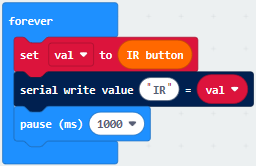

Complete Program：

Click“JavaScript" to view the corresponding JavaScript code:

Code explanation: when the buttons are not pressed, the serial monitor
constantly shows 0; when pressed, the corresponding key values are displayed.

**Note：**

The remote control in this kit is not inclusive of batteries. We recommend you
to purchase them (battery type:CR2025).

Make sure IR remote is good before test. There is a tip for you to check it.

Open the cellphone camera , make IR remote control point at camera and press
button. The remote control is good if you see the flashing light in the camera.

Download code to micro: bit board and don’t plug off USB cable
Click

([How to quick download?](#_7.3.快速下载))

Make IR remote control point at IR receiver and press the button, the serial
monitor will display the corresponding key values, as shown below：

Open CoolTerm, click Options to select SerialPort. Set COM port and 115200 baud
rate(the baud rate of USB serial communication of Micro:bit is 115200 through
the test). Click“OK”and“Connect”.

CoolTerm serial monitor shows the key value as follows:

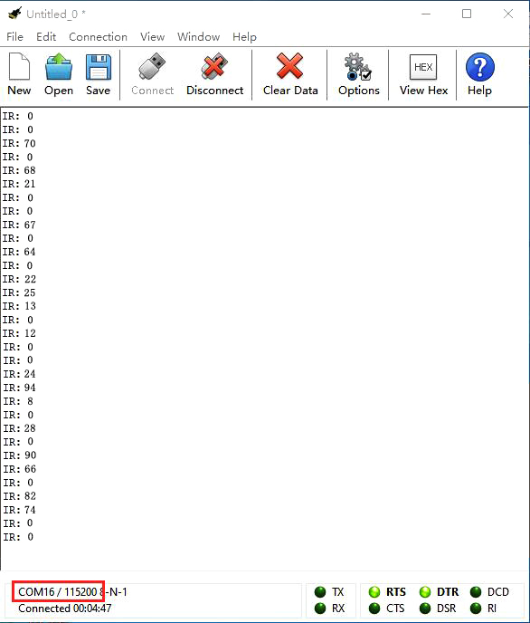

The key value is displayed as for your reference:

21.2: IR Remote Control

1.  **Description：**

In this project, we combine IR remote control with car shield to make an IR
remote smart car. Its principle is to control the motion of car by sending key
signals from IR remote control to IR receiving module of car shield.

**2. What You Need**

1.  Insert micro:bit board into slot of V2 shield.

2.  Place batteries into battery holder.

3.  Plug smart car in power

4.  Link with computer by USB cable and enter online micro:bit editor

5.  Import Hex profile [**(How to import?)** ](#_7.6.导入代码), or click“New
    Project”and drag blocks step by step(add k-bit extension library first)

[**(How to add k-bit extension?)**](#M11)

1.  **Flow Chart**

1.  **Test Code:**

Import hex file.

| File Type | Route                                                                        | File Name                        |
|-----------|------------------------------------------------------------------------------|----------------------------------|
|  Hex file | ../Makecode Code/6.21：IR Remote Control Smart Car/6.21.2：IR Remote Control |  microbit-IR Remote Control .hex |

Or you could edit code step by step in the editing area.

1.  Enter“IrRemote”to get block“connect IR receiver at P0”

Put it into“on start”block

IR receiving module is controlled by P16 of micro:bit board, so click P0 to
select P16.

\*\*\*\*\*\*\*\*\*\*\*\*\*\*\*\*\*\*\*\*\*\*\*\*\*\*\*\*\*\*\*\*\*\*\*\*\*\*\*\*\*\*\*\*\*\*\*\*\*\*\*\*\*\*\*\*\*\*\*\*\*\*\*\*\*\*\*\*\*\*\*\*\*\*\*\*\*

1.  a. Enter “Neopixel”→“set strip to Neopixel at pin P0 with 24 leds as RGB
    (GRB format)”

b. Place it into“on start”block，

c. Signal end D1 of KEYES-2812-18R module is connected to D5(P5 of micro:bit
board) of expansion . So we set to P5.

d. KEYES-2812-18R module comes with 18 pcs WS2812 RGB, then change 24 into 18.

\*\*\*\*\*\*\*\*\*\*\*\*\*\*\*\*\*\*\*\*\*\*\*\*\*\*\*\*\*\*\*\*\*\*\*\*\*\*\*\*\*\*\*\*\*\*\*\*\*\*\*\*\*\*\*\*\*\*\*\*\*\*\*\*\*\*\*\*\*\*\*\*\*\*\*\*\*

1.  Go to“Variables”→“Make a Variable...”→“New variable name：”dialog box.

Enter“val”and click“OK”to produce variable“val”

Move“set val to 0”under“set strip...RGB(RGB format)” block

Then create variable“val2”in same way

Drag“set val2 to 0”into“on start”

Edit the code as follows:

\*\*\*\*\*\*\*\*\*\*\*\*\*\*\*\*\*\*\*\*\*\*\*\*\*\*\*\*\*\*\*\*\*\*\*\*\*\*\*\*\*\*\*\*\*\*\*\*\*\*\*\*\*\*\*\*\*\*\*\*\*\*\*\*\*\*\*\*\*\*\*\*\*\*\*\*\*

1.  Copy“set val2 to 0”once and move it into“forever”block.

Click the triangle button to select“val”

Go to“IrRemote”to drag block“IR button”into 0 box.

\*\*\*\*\*\*\*\*\*\*\*\*\*\*\*\*\*\*\*\*\*\*\*\*\*\*\*\*\*\*\*\*\*\*\*\*\*\*\*\*\*\*\*\*\*\*\*\*\*\*\*\*\*\*\*\*\*\*\*\*\*\*\*\*\*\*\*\*\*\*\*\*\*\*\*\*\*

1.  Enter“Logic”→“if true then”and place it into“forever”

Drag block“=”block into“true”box

Go to“Variables”and move“val”block into left box of“=”.

Then click“=”to set“≠”

1.  Duplicate“set val2 to 0”block again and leave it under the block
    “if...val...then”block.

Then drag out variable“val”into 0 box.

\*\*\*\*\*\*\*\*\*\*\*\*\*\*\*\*\*\*\*\*\*\*\*\*\*\*\*\*\*\*\*\*\*\*\*\*\*\*\*\*\*\*\*\*\*\*\*\*\*\*\*\*\*\*\*\*\*\*\*\*\*\*\*\*\*\*\*\*\*\*\*\*\*\*\*\*\*

1.  Go to“Logic”to drag block“if. true..then...else”under block“set val2 to
    val”block.

Then tap“”four times and
delete“”behind“else”

Move“=”block into“true”box.

1.  Go to“Variables”to move block“val2”into left box of“=”

Change 0 into 70.

\*\*\*\*\*\*\*\*\*\*\*\*\*\*\*\*\*\*\*\*\*\*\*\*\*\*\*\*\*\*\*\*\*\*\*\*\*\*\*\*\*\*\*\*\*\*\*\*\*\*\*\*\*\*\*\*\*\*\*\*\*\*\*\*\*\*\*\*\*\*\*\*\*\*\*\*\*

1.  Enter“K_Bit”→“car RunForward speed: 0%”

Leave it under the second block“if...val2..then”block and change 0 into 40.

Go to“Neopixel”to move block“strip show color red”under block“car RunForward
speed: 40%”

Change red into green.

\*\*\*\*\*\*\*\*\*\*\*\*\*\*\*\*\*\*\*\*\*\*\*\*\*\*\*\*\*\*\*\*\*\*\*\*\*\*\*\*\*\*\*\*\*\*\*\*\*\*\*\*\*\*\*\*\*\*\*\*\*\*\*\*\*\*\*\*\*\*\*\*\*\*\*\*\*

1.  Replicate code“val2=70”once and leave it into box behind“else if...then”,

Change 70 into 68

1.  Click “K_Bit” to drag “LeftSide motor run Forward speed: 0%” block under the
    first“else if ....then”block. And alter 0 into 15

Duplicate“LeftSide motor run Forward speed: 15%”once and alter LeftSide into
RightSide and 15 into 35.

Drag“strip show color red”block under the block“RightSide motor run Forward
speed: 35%”

Change red into blue.

1.  Replicate“val2=68”block and code string
    

Then edit the code string as follows:

1.  Copy“val2=67”again and keep it into the third box behind“else
    if....then”block

Change 67 into 21.

Replicate code string and place
it under the third“else if....then” block.

Change RunForward into RunBack and green into purple

1.  Then replicate“val2=21”once and“strip show color purple”block again

Change 21 into 64 and purple into red

Click“K_Bit”to move out block“car stop”

Edit the code string as follows:

Complete Program：

Click“JavaScript" to view the corresponding JavaScript code:

1.  **Test Result：**

Download code to micro:bit board, and turn on the switch at the back of
micro:bit car.

Make IR remote control point at micro:bit and press the button to control smart
car to move.

button makes smart car move
forward，stands for turning
left，implies rightward turning
，indicates moving
backward，control smart car to
stop，and 18 RGB lights of KEYES-2812-18R module light up the corresponding
color.

([How to download?](#A01) [How to quick download?](#_7.3.快速下载))

Note: the distance between IR remote control and IR receiving head of smart car
are supposed less than 5m, during the test.

### 22: Bluetooth Multi-purpose Smart Car

22.1: Read Bluetooth Data

1.  **Description：**

In this lesson, we will control smart car to perform different functions by
Bluetooth of micro:bit board. We provide you with an App.

Let’s know its interface and function of every icon first

**2. What You Need**

1.  Insert micro:bit board into slot of V2 shield.

2.  Place batteries into battery holder.

3.  Plug smart car in power

4.  Link with computer by USB cable and enter online micro:bit editor

5.  Import Hex profile[**(How to import?)** ](#_7.6.导入代码), or click“New
    Project”and drag blocks step by step(add k-bit and Bluetooth extension
    library first)

[**(How to add k-bit extension?)**](#M11)

As the Bluetooth and extension radio can’t work together, their extension
libraries are not compatible.

Therefore, remove extension(s) and add bluetooth please if you see the following
prompt box pop up.

**3. Test Code：**

Import hex file

| File Type | Route                                                                                | File Name                        |
|-----------|--------------------------------------------------------------------------------------|----------------------------------|
| Hex file  | ../Makecode Code/6.22：Bluetooth Multi-purpose Smart Car/6.22.1：Read Bluetooth Data | microbit-Read Bluetooth Data.hex |

Or you could edit code step by step in the editing area.

1.  Enter“Advanced” →“Serial” → “serial redirect to USB”

Place it into“on start”

\*\*\*\*\*\*\*\*\*\*\*\*\*\*\*\*\*\*\*\*\*\*\*\*\*\*\*\*\*\*\*\*\*\*\*\*\*\*\*\*\*\*\*\*\*\*\*\*\*\*\*\*\*\*\*\*\*\*\*\*\*\*\*\*\*\*\*\*\*\*\*\*\*\*\*\*\*

1.  Click“Bluetooth”→“on bluetooth connected”

Go to“Basic”to move“show icon”block into“on bluetooth connected” block.

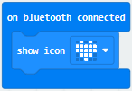

\*\*\*\*\*\*\*\*\*\*\*\*\*\*\*\*\*\*\*\*\*\*\*\*\*\*\*\*\*\*\*\*\*\*\*\*\*\*\*\*\*\*\*\*\*\*\*\*\*\*\*\*\*\*\*\*\*\*\*\*\*\*\*\*\*\*\*\*\*\*\*\*\*\*\*\*\*

1.  Click“Variables”→“Make a Variable...”→“New variable name：”dialog box.

Input“connected” and click “OK” to create variable“connected”.

Drag“set connected to 0” under block “show icon” and change 0 into 1.

\*\*\*\*\*\*\*\*\*\*\*\*\*\*\*\*\*\*\*\*\*\*\*\*\*\*\*\*\*\*\*\*\*\*\*\*\*\*\*\*\*\*\*\*\*\*\*\*\*\*\*\*\*\*\*\*\*\*\*\*\*\*\*\*\*\*\*\*\*\*\*\*\*\*\*\*\*

1.  Go to“Loops”to move block“while true do...”into“on bluetooth
    connected”block.

Enter“Logic”to drag out “=”block.

Click“Variables” to drag “connected” into left box of “=” block and change 0
into 1.

\*\*\*\*\*\*\*\*\*\*\*\*\*\*\*\*\*\*\*\*\*\*\*\*\*\*\*\*\*\*\*\*\*\*\*\*\*\*\*\*\*\*\*\*\*\*\*\*\*\*\*\*\*\*\*\*\*\*\*\*\*\*\*\*\*\*\*\*\*\*\*\*\*\*\*\*\*

1.  Then we generate variable“rec_data”in same way.

Then drag out“set rec_data to 0”and place it into block“while connected=1
do...”block.

Click“Bluetooth” →“more” →“bluetooth uart read until new line( )”

Keep it into 0 box and click triangle button to select \#.

\*\*\*\*\*\*\*\*\*\*\*\*\*\*\*\*\*\*\*\*\*\*\*\*\*\*\*\*\*\*\*\*\*\*\*\*\*\*\*\*\*\*\*\*\*\*\*\*\*\*\*\*\*\*\*\*\*\*\*\*\*\*\*\*\*\*\*\*\*\*\*\*\*\*\*\*\*

1.  Go to“Advanced”→“Serial”→“serial write string”

Move it below“set rec_data...until\#” block

And combine variable“rec_data”with“serial write string”block.

1.  Click“Advanced” →“Serial” →“serial write line” and edit code string as
    follows:

1.  Go to“Bluetooth”→“on bluetooth disconnected”

Copy“show icon”block and keep it into block“on bluetooth disconnected”

Click triangle button to
select“”pattern.

Complete Program

pattern
Click“JavaScript" to view the corresponding JavaScript code:

**5. Test Result：**

If you drag blocks step by step, you need to set as follows after finishing test
code.

Click

However, you could skip this step if you directly import test code.

After setting, download code to micro:bit board, don’t plug off USB cable([How
to download?](#A01) [How to quick download?](#_7.3.快速下载))

Next to download App.

IOS system

a. Open App Store

b. Search keyes Bit Car and
click“”icon to download keyes Bit
Car

c. After the download, tap“OK”when a dialog box appears up.

d. Enable Bluetooth of cellphone or iPad.

Click“connect”button to search Bluetooth.

Then select“BCC micro:bit”to connect Bluetooth.

Android system

Scan the QR code and enter website to download keyes_Bit_Car.apk

Then click“Always allow”and tap“install”

e. Tap“Open”or click“keyes Bit Car”icon to enter app.

A dialog box appears, then click“Allow”to turn on Bluetooth.

You also enable Bluetooth firstly.

f. Click“CONNECT”to search and link with Bluetooth

Open CoolTerm and click Options to select SerialPort. Set COM port and 115200
baud rate(the baud rate of USB serial communication of Micro:bit is 115200
through the test). Click“OK”and“Connect”.

Point at micro:bit board and press the icons on APP, the corresponding
characters are shown on CoolTerm monitor.

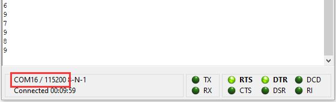

Through the test, we get the function of every icon, as shown below:

22.2: Multi-purpose Smart Car

1.  **Description：**

In this lesson, we will control the smart car to perform multipurpose function.

**2. What You Need**

1.  Insert micro:bit board into slot of V2 shield.

2.  Place batteries into battery holder.

3.  Plug smart car in power

4.  Link with computer by USB cable and enter online micro:bit editor

5.  Import Hex profile [**(How to import?)** ](#_7.6.导入代码), or click“New
    Project”and drag blocks step by step(add k-bit and Bluetooth extension
    library first)

[**(How to add k-bit extension?)**](#M11)

As the Bluetooth and extension radio can’t work together, their extension
libraries are not compatible.

Therefore, remove extension(s) and add bluetooth please if you see the following
prompt box pop up.

**3. Test Code：**

| File Type | Route                                                                                    | File Name                            |
|-----------|------------------------------------------------------------------------------------------|--------------------------------------|
| Hex file  | ../Makecode Code/6.22: Bluetooth Multi-purpose Smart Car/6.22.2：Multi-purpose Smart Car | microbit-Multi-purpose Smart Car.hex |

We don’t list the detailed steps to design code due to the whole program is
complex. You could drag file or drag blocks to finish.

Complete Program

Click“JavaScript" to view the corresponding JavaScript code:

1.  **Test Result：**

We will control micro:bit smart car to move via app.

Enter Makecode online editor→Projecting
Settings→, enable “No
Pairing....”(you could skip this step if you import test code directly)

Download code and turn on the switch at the back of micro:bit car. Then control
smart car via “keyes Bit Car”app

([How to download?](#A01) [How to quick download?](#_7.3.快速下载))

##  Resources

Download test code, driver:

<https://fs.keyestudio.com/KS0426>

Wiki page: <https://wiki.keyestudio.com/Main_Page>

Official website: <https://keyestudio.com/>
